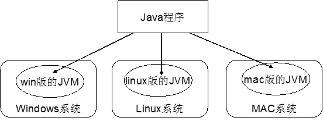
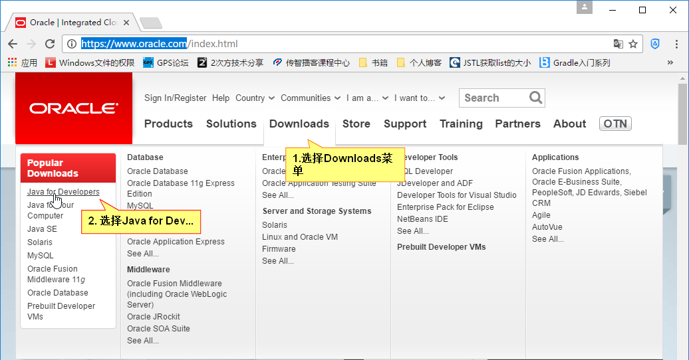
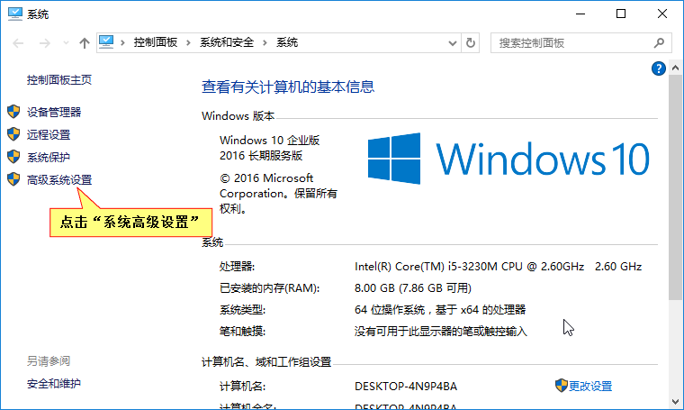

Java学习文档

# 1 基础知识

## 1.1 软件
　　软件就是计算机数据与指令的集合。软件 = 数据 + 指令 + 文档。

　　软件的目的是提高人与计算机交流的效率，方便人与机器交互。

## 1.2 常用命令
　　现在人机交互的方式分为图形化界面交互和命令式交互。

　　图形化界面简单直观，容易操作；使用命令的方式需要记住命令，操作麻烦。

　　但是在程序开发中，使用命令更加高效，有时使用一条命令就能完成若干的操作。我们也需要学些简单的命令。

　　在Windows中执行命令需要在CMD窗口中输入命令。打开控制台的方法：Windows + R键，输出cmd并回车。

　　常用的DOS命令：

　　\> 盘符: ：进入指定的盘符。

　　\> dir：列出当前目录下文件和文件夹

　　\> md：创建目录

　　\> rd：删除目录，不能删除非空的文件夹

　　\> cd：进入指定目录，cd ..表示退回上一级，cd \表示退回到根目录。

　　\> echo "hello java" > a.txt：将文本写入到指定文件，将会创建文件

　　\> type a.txt：显示文件内容

　　\> del：删除文件

　　\> exit：退出控制台

　　\> cls：清空屏幕

　　另外，在控制台中可以用：

　　*和?通配符；按下tab进行命令补全；上下方向键显示历史命令。

# 2 Java简介
　　Java是SUN (Stanford University Network，斯坦福大学网络)公司于1995年推出的一门高级编程语言。Java原是印度尼西亚爪哇岛的英文名称，因盛产咖啡而闻名。Java最初目标在于家用电器等小型系统的编程，随着市场的变化，Java着眼于网络应用的开发。

　　1995年5月，JAVA语言诞生。

　　2004年9月，J2SE 1.5发布，这是Java发展史上的一个里程碑。为了表示该版本的重要性，J2SE 1.5更名为Java SE 5.0。

　　2005年，JAVA版本正式分为JAVA EE（企业级），JAVA SE（基础）和JAVA ME（嵌入式）。我们现在学习的是Java SE，以后要学Java EE。必须先学好Java SE基础才能进行Java EE或者Android应用的开发。

　　2006年12月，Sun发布了Java 6.0。

　　2009年，Oracle（甲骨文公司）收购了Sun公司。即现在Java归Oracle管理。

　　2011年7月，Oracle发布了Java 7。

　　2014年，甲骨文公司发布了Java 8正式版。

## 2.1 Java的跨平台特性

　　这里着重讲Java的跨平台特性，语音的其他特性就不讲了，只能在学习中体会。
跨平台就是软件的运行不依赖于具体的操作系统。在一个操作系统下开发的应用，放到另一个操作系统下依然可以运行。而Java就具有这样的特性，Java语言编写成的程序在不同的OS上都可以运行，“一次编写，处处运行”。

　　而C语言的跨平台性就不好，在Windows上编译生成的C语言程序，在Linux系统下是不能运行的。至少也要将源代码再编译生成不同的目标代码，况且，不同OS的系统调用API不同，就更加大了跨平台的难度。

　　Java的跨平台是通过JVM（Java Virtual Machine，Java虚拟机）来实现的。

　　JVM相当于是一个用软件模拟的计算机。Java源程序会编译成.class字节码文件。.class字节码文件由JVM解释运行。因此，只要为每种操作系统提供不同的JVM，就能实现跨平台。即JVM拿到的是同一个字节码文件，由JVM适应不同的OS。图解：



# 3 搭建Java开发环境

开发Java需要安装JDK，即Java开发工具(Java Development Kit)。JDK是整个Java的核心，包括了Java运行环境、Java工具和Java基础类库。

## 3.2 安装JDK

　　首先在Oracle官网https://www.oracle.com找到JDK下载页面。



　　之后在Java SE的页面，点击下载的图标，出现下面界面，要按照图中所示操作，即接受协议再下载符合自己电脑的版本：


　　下载完后，点击安装程序进行安装。安装时注意选择安装路径，路径中不要有空格和中文。安装时，把“公共JRE”这个组建去掉，不予安装，因为JDK中已经包含了JRE，不再需要额外的JRE。

　　说明：JRE就是Java运行时环境(Java Runtime Environment)。JRE用于支持运行Java程序，包括JVM和运行Java程序需要的核心类库。如果只是使用Java应用的用户，则只要安装公共JRE即可。

## 3.2 JDK安装目录介绍

　　bin目录：存放Java编译器、解释器等工具。

　　db目录：这里是JDK附带的一个轻量级数据库，名叫Derby。

　　include目录：存放调用系统资源的接口文件。

　　jre目录：存放Java运行环境文件。

　　lib目录：存放Java类库文件。

　　src.zip文件：是JDK Java类的源码。IDE会找到这个文件，以便在IDE中查看JDK源码。

## 3.3 配置环境变量

### 3.3.1 环境变量及其作用

　　环境变量用于存储操作系统级别的变量。环境变量分为系统变量和用户变量，系统变量可被系统中的所有用户共享使用；而用户变量只能被当前用户使用。因此每个用户都能配置自己的用户变量。用户也能设置系统变量，但是建议将自行配置的环境变量放在自己的用户变量中，这样比较清晰，互不影响。

　　通过实践表明环境变量能在系统中使用。首先查看下本机的环境变量：桌面 – 右键“此电脑” – 属性，出现下面界面，点击“高级系统设置”：



　　在新界面中（默认“高级”选项卡），点击“环境变量”按钮：


　　新界面显示的内容就是本机的用户变量和系统变量。

　　我们可以用这里的变量，在Windows中环境变量的变量名不区分大小写。比如用户变量里的“TEMP”表示本用户的临时目录，在文件管理器地址栏中输入%TEMP%回车就能进入此目录。%变量名%就表示引用这个变量。同样在控制台中执行echo %TEMP%也能显示此路径。
另外，还有一个用户变量叫USERPROFILE，这个变量在界面中隐藏了。这个变量指向用户的主目录，用这个有时很方便。

### 3.3.2 Path环境变量

　　前面说JDK下的bin目录是一些工具，我们需要使用。比如进入该目录下打开控制台，执行java命令会有一系列使用命令的提示。但是如果不在此目录下，该命令就无效：


　　但是，一些系统命令，无论在什么路径下都能使用，比如calc（打开计算器）、diskpart命令等。

　　为了在其他路径下也能使用JDK中的命令，需要配置Path环境变量。

　　PATH变量是一个特殊变量，一旦把一个路径添加到Path环境变量中，那么该目录下的命令就能在控制台的任意路径下使用。系统命令就是在系统Path命令中设置了才能在任何地方使用的。

　　我们可以在系统变量的Path变量中添加上JDK\bin目录，但是前面说过，我们一般把自行配置的变量配置到用户变量中。


　　在原有路径之后添加自己的路径，注意路径之间用英文半角分号隔开！


　　然后点击确定，并且下层界面也要依次点确定。

　　之后，需要重新启动控制台，这时在任意路径下都能使用java命令了。

　　但是一般标准的做法是在系统变量中增加一个变量，名字叫“JAVA_HOME”，这个就是JDK的根目录，然后Path变量引用这个JAVA_HOME变量。这样的设置有利于以后使用大多数IDE软件，因为很多软件会先检测JAVA_HOME这个变量。

　　（1）首先在“环境变量”界面新建一个用户变量，名叫“JAVA_HOME”，值是JDK根目录。（以后的很多工具也最好配置工具的根目录，都是以_HOME结尾。标准做法。）

　　（2）然后添加Path环境变量（之前直接设置的JDK\bin可以删除了），值为“%JAVA_HOME%\bin”，就是指向JDK的bin目录。这也说明了变量间可以相互引用，还用通过 “%变量名%”引用。

　　（3）点击确定，然后重启控制台，即可使用java中命令了。

　　还需要了解一下命令搜寻的顺序：

　　（1）首先在当前目录下寻找命令，如果找不到就寻找环境变量中的路径。

　　（2）先寻找用户Path变量中的路径，若找不到就寻找系统Path变量中的路径。

### 3.3.3 设置临时环境变量

　　用set命令可以查看或设置临时变量，用法如下：

　　Set：查看所有环境变量信息。会整合用户变量和系统变量，比如用户变量和系统变量都有path变量。

　　Set 变量名：查看具体一个环境变量的值。

　　Set 变量名= ：清空一个环境变量的值。

　　Set 变量名=具体值：给指定变量定义具体值。

　　若想在原有环境变量值基础上添加新值，则通过%变量名%引用原有值，然后加上新值再设置给该变量即可。

　　例如给path环境变量加入新值

　　Set path=新值;%path%

　　注意：用set命令配置的环境变量只在当前控制台窗口有效，一旦窗口关闭，该临时的配置就消失了，还会变为自行设置的值，只是临时起作用。

# 4 Java程序入门

## 4.1 编程前的准备

　　我们首先用简单的工具写Java代码并编译运行。首先要了解纯文本文件和简单的文本编辑器。

　　windows中自带一个叫记事本的软件，记事本保存文档的格式是txt格式，就是英语text的缩写。我们称这种文件为“纯文本文件”。这是因为纯文本文件只能保存文本内容，不能保存文本的样式（虽然可以通过设置软件来使看到的字体变大等）。而docx（Microsoft Office）等文档不仅能保存文本内容，还能保存文本的各种复杂样式。所以，docx和txt存储同样的文本内容，docx文件比txt的大。而且docx文件无法用记事本打开，会乱码，无法解析因为docx有特定的格式。

　　因此，纯文本文件就是这样的文件：

　　1） 只有文本，没有样式；

　　2） 用记事本等纯文本编辑器可读，不是乱码。

　　而源代码都是纯文本格式的，里面只写代码内容，包括java源文件、html文件等等。只是我们编辑html时用文本编辑器，而用户使用html时是使用浏览器浏览的。可以设置打开方式。

　　Windows自带的记事本不太好用，我们使用Notepad++这款文本编辑器。


## 4.2 第一个Java程序

　　首先选定一个目录，创建一个纯文本文件，叫Demo.txt。注意，一定要设置文件扩展名为可见，因为我们要把文件扩展名改为Demo.java，否则扩展名就是Demo.java.txt了，是错误的。

　　然后将Demo.txt改名为Demo.java。并用Notepad++打开（右键用Notepad++打开）。编写如下内容：

```java
public class Demo {
    public static void main(String[] args) {
        System.out.println("Hello World");
    }
}

```

　　这段代码的作用是在控制台打印出“Hello World”，目前我们写的都是控制台程序。

　　Class用户定义类，这是面向对象的内容，先写着。Demo类中有main方法，这是主方法，args是接收的命令行参数，因为参数有多个，所以用字符串数组接收（Java中String表示字符串类）。public static先这样写着，是面向对象的内容。System.out.println()作用是打印一行数据。

　　通过上面的分析，发现Java也是类C语言，因此面向过程的大部分内容都和C是一样的，下面就带过了。

## 4.3 程序的编译和运行

　　写完了上面的代码，需要将代码进行编译并运行，这时需要使用JDK\bin下的工具，如果不能使用这些工具的话，则说明环境变量没有配置好。

　　（1）先用javac工具将源文件编译成class字节码文件。使用命令：

javac 源文件。例如此例中使用：javac Demo.java。这样就能得到字节码文件。

　　（2）有了字节码文件，就能运行程序了。使用java工具运行该字节码。

java 字节码文件名（不要加.class扩展名），例如：java Demo。


　　从上述看出，Java是先编译成字节码文件，然后由JVM解释执行字节码文件。由JVM解释执行保证了Java的跨平台性。做下对比：

　　C语言是编译型语言，直接编译成目标平台的程序，可直接运行；

　　JavaScript是解释型语言，不需编译，直接由浏览器的JavaScript引擎解释执行。

# 5 Java面向过程编程的新知识

　　这里总结概述Java中编写面向过程编程的注意点，主要将新特点，和C语言同样之处不再多说。

## 5.1 命名规则和注释

　　标识符的命令不能是关键字，像class、int、float等都是关键字，另外，还要遵循以下规则：

　　1. 标识符由unicode字符(推荐英文)、数字(0~9)、下划线(_)和美元符号($)组成。
　　2. 不能以数字开头
　　3. 严格区分大小写

　　标识符的命名规则要求“见名知意”。常用的命名规则：

　　1. 包(package)名：包其实就是文件夹，用于管理多个类，包名采用小写，如：com.xzit.xdxy
　　2. 类或者接口：Pascal规范，例如StudentInfo。
　　3. 方法/变量名：camel规范，例如studentAge。
　　4. 常量：若常量名是一个单词，则全部字母大写，若是多个单词，则全部字母大写，中间用下划线_隔开。

　　Java中的注释：

　　//单行注释

　　/*…*/ 多行注释

　　文档注释： /** … */，这种注释稍后再说明。

　　注意多行注释不能嵌套和注释的调试作用。

## 5.2 数据类型

　　基本数据类型：

　　byte(1字节) 数值范围：128~127

　　short(2字节)

　　int(4字节)

　　long(8字节)，定义long类型，可在数据后加上大写字母L以便区分。

　　float(4字节)，定义float类型，必须在数据后加上字母F或者f，否则浮点数默认是double类型的，强转成float会丢失精度，因此报错。

　　double(8字节)

　　char(2字节，unicode编码)

　　boolean(1字节)，值只有true和false，布尔类型。

　　注意不要使用未初始化的变量。

　　不同进制的数据在Java中的表示：

　　1. 二进制：以0b开头
　　2. 八进制：以0开头
　　3. 十六进制：以0x开头

　　Java中也能使用转义字符。和C相同。

## 5.3 数据类型转换

　　1.自动类型转换（隐式）

　　2.强制类型转换（显式）：(变量类型)变量名。注意可能会损失精度。

　　3.boolean类型不能转换为其他的数据类型

　　下面是例子：

　　例1：

```java
public class Demo {
    public static void main(String[] args) {
        short a = 1;
        a = a + 1; // 错误，因为a先加1，会自动转换成int类型
        short b = 2;
        b++; // 正确，其中隐含了一个强制转换
    }
}

```

　　例2：

```java
public class Demo {
    public static void main(String[] args) {
        byte b1 = 3, b2 = 4, b3;
        b3 = b1 + b2; // 错误
        /*
        为什么byte b1 = 3不报错，而将两个byte相加再赋值给一个byte就会报错（仅限于byte类型）？
        byte b1 = 3是正常的，因为3在byte范围内，赋值时直接将3作为byte类型给b1.
        b3 = b1 + b2报错是 java 的机制导致的：
        java在对byte类型运算时，会将其转换为int类型，两个int类型相加，赋值给byte类型肯定会报错的。
         */

        byte a = 3 + 4;
        // 这个不报错。
        // 3和4是常量，在编译时编译器就讲3+4解析成常量7赋值给变量a了。
        // 7在byte范围内，直接赋值，这是编译器的优化。
    }
}

```

## 5.4 运算符

　　（1）算术运算符：加减乘除、取余、自增自减。

　　例1：符号+还能用于连接字符串。加法符号+是从左向右结合，只要符号左右两边不都是数字，就是连接字符串。语句System.out.println();用于输出信息。

```java
public class Demo {
    public static void main(String[] args) {
        System.out.println("hello"  + 'a' + 1);
        System.out.println('a' + 1 + "hello");
        System.out.println("5 + 5 = " + 5 + 5);
        System.out.println(5 + 5 + " = 5 + 5");
    }
}

```

　　运行结果：

```
helloa1
98hello
5 + 5 = 55
10 = 5 + 5
```

　　（2）取模后，结果的正负取决于被除数。利用取余，可以判断一个整数的奇偶等
　　例2：取余结果的正负号。

```java
public class Demo {
    public static void main(String[] args) {
        System.out.println(-10 % 3);    // -1
        System.out.println(10 % -3);    // 1
        System.out.println(-10 % -3);   // -1
    }
}

```

　　例3：判断整数奇偶。

```java
public class Demo {
    public static void main(String[] args) {
        int num = 23;
        if(num % 2 == 0) {
            System.out.println(num + "是偶数");
        } else {
            System.out.println(num + "是奇数");
        }
    }
}

```

　　例4：如果今天是星期五，那么1000天后是星期几？

```java
public class Demo {
    public static void main(String[] args) {
        int today = 5; // 今天周五
        int after1000 = (today + 1000) % 7;
        System.out.println("1000天后是周" + after1000);
    }
}

```

　　（3）赋值运算符=和复合运算符，比如sum += 1.

　　（4）比较运算符的结果是boolean类型，只有true和false两种结果。例如等于==，不等于!=，大于>，小于<，大于等于>=和小于等于<=。

　　（5）逻辑运算符：与（&和&&，&&是短路与），或（|和||，||是短路或），非（!）和异或（^，即左右两边表达式都为true或false时，结果为false，否则结果为true，即一个true一个false）

```java
public class Demo {
    public static void main(String[] args) {
        System.out.println( (5 > 3) ^ (4 > 2) );  // 表达式均为true，结果为false
        System.out.println( (5 > 3) ^ (4 < 2) );  // 结果为true
    }
}

```

　　（6）位运算符。&、|和^除了可以作为逻辑运算符，也可以作为位运算符。位运算是对两个操作数中的每一个二进制位都进行运算。另外，~是取反操作，只有一个操作数。

　　一个数异或同一个数两次，结果还是那个数，可以用这个规律进行数据的加密。

　　（7）移位操作符：左移<<，右移>>，无符号右移>>>（被移位二进制最高位无论是0或者是1，空缺位都用0补）。

　　左移：被移除的高位丢弃，右边空缺位补0。左移就相当于乘以2的位移位数次幂。右移相当于除以2的移动位数次幂。

　　最有效率的方式算出2乘以8：2 << 3.

　　右移：被移位的二进制最高位是0，右移后，空缺位补0；若最高位是1，空缺位补1。

　　无符号右移：被移位二进制最高位无论是0或者是1，空缺位都用0补。

　　（8）三元运算符

　　（9）优先级。使用括号能改变优先级。

## 5.5 流程控制

　　流程控制还是：顺序、选择和循环结构。使用的关键字的用法都是相同的，可以使用if、else、switch、三元表达式、do…while、while、for、break和continue。

　　switch语句的控制表达式的数据类型只能是byte、short、char、int（不能是long类型）、枚举类型和String类型（不能是StringBuffer或StringBuilder类型）。

　　例1：判断输入的月份有多少天。【学习Scanner获取用户输入和判断闰年】

　　说明：获取从键盘输入的数据，需要用到Scanner类：

　　1. 导包：import java.util.Scanner;

　　2. 创建对象：Scanner sc = new Scanner(System.in);

　　3. 获取int类型数据：int x = sc.nextInt();

```java
import java.util.Scanner;

public class Demo {
    public static void main(String[] args) {
        int userInput; // 记录用户输入的数据
        Scanner sc = new Scanner(System.in); // 用System.in创建Scanner对象
        do {
            System.out.println("请输入月份：(输入-1退出程序)");
            userInput = sc.nextInt(); // 获得输入的年份
            // 使用switch
            switch(userInput) {
                case 1:
                case 3:
                case 5:
                case 7:
                case 8:
                case 10:
                case 12:
                    System.out.println(userInput + "月有31天");
                    break;
                case 4:
                case 6:
                case 9:
                case 11:
                    System.out.println(userInput + "月有30天");
                    break;
                case 2:
                    System.out.println("请输入年份");
                    int year = sc.nextInt();
                    int days = ((year % 400 == 0) || (year % 4 == 0 && year % 100 != 0)) ? 29 : 28;
                    System.out.println(year + "年" + userInput + "月有" + days + "天");
                    break;
                case -1:
                    break;
                default:
                    System.out.println("输入月份错误");
                    break;
            }
        } while(userInput != -1);
    }
}

```

　　例2：猜数字游戏。【学习生成随机数】
　　说明：使用Math.random()方法能生成一个[0.0, 1.0)之间的随机数，现在想生成[1, 100]之间的随机数，则用式子：(int)(Math.random() * 100 + 1) 来生成。每次运行程序生成的数字是不一样的，说明Math.random()是以当前时间作为种子。

```java
import java.util.Scanner;

public class Demo {
    public static void main(String[] args) {
        Scanner sc = new Scanner(System.in);
        int number = (int)(Math.random() * 100 + 1);
        int userInput = number--; // 防止初始化数据与number一致
        do {
            System.out.println("请输入你猜的数字：");
            userInput = sc.nextInt();
            if(userInput > number) {
                System.out.println("猜的大了");
            } else if (userInput < number) {
                System.out.println("猜的小了");
            } else {
                System.out.println("猜中了！");
            }
        } while (userInput != number);
    }
}

```

　　例3：跳出或者结束一个最内层循环用break/continue，如果想跳出/结束多个循环，则使用标签跳转。break和continue都可以结合标记使用：

```java
public class Demo {
    public static void main(String[] args) {
        outer:
        for (int x = 0; x < 3; x++) {
            for (int y = 0; y < 4; y++) {
                break outer;
            }
            System.out.println("hello");
        }
    }
}

```

# 6 扩展：用异或对文件加密/解密

```java
import java.io.*;

public class Demo {
    /**
     * 由于加密和解密都是对目标文件异或，因此，只有一个主程序。
     * @param args 定义此程序的参数1是输入文件，参数2是输出文件
     */
    public static void main(String[] args) throws IOException {
        // 参数个数错误提示
        if(args.length < 2) {
            System.out.println("请正确使用参数！");
            System.out.println("参数用法：");
            System.out.println("参数1:输入文件，参数2:输出文件，参数3:加密/解密的数字");
            System.out.println("例子：mypwd d:/1.txt d:2.txt 21");
            return;
        }
        String inFilePath = args[0];
        String outFilePath = args[1];
        int code;
        try {
            code = Integer.parseInt(args[2]);
        } catch (Exception e) {
            System.out.println("加密/解密的密码必须是数字");
            return;
        }

        // 根据路径创建文件
        File inFile = new File(inFilePath);
        File outFile = new File(outFilePath);
        // 输入文件不存在提示
        if(!inFile.exists()) {
            System.out.println("文件： \"" + inFilePath + "\"  不存在");
        }

        // 根据File对象创建输入和输出流
        FileInputStream input = new FileInputStream(inFile);
        FileOutputStream output = new FileOutputStream(outFile);

        // 读取到就把数据异或
        int content = 0;
        while((content = input.read()) != -1) {
            // 异或到输出流
            output.write(content ^ code);
        }
        // 关闭资源
        output.close();
        input.close();
    }
}

```

# 7 方法

## 7.1 方法的格式

　　Java中的方法就是函数，Java中函数不需要在使用之前声明，直接定义即可使用。Java中方法的格式：

　　修饰符 返回值类型 方法名(参数类型和参数名)

　　现在的阶段我们使用的修饰符就是public static。

## 7.2 方法的重载

　　在同一个类中，有一个以上的同名函数，只要函数的参数列表或参数类型不一样即可，与返回值无关， 这些统称为方法的重载。

　　方法的重载让我们可以定义重名的函数。

# 8 数组

## 8.1 数组的定义

　　定义的格式：

　　type[] arrayName;

　　type表示数组存储的数据类型，arrayName是数组名称。比如：

　　int[] arr;

　　表示的是定义了一个int类型的数组，数组名是arr，该数组存储int类型数据。

## 8.2 数组的初始化

　　数组的初始化有两种方法，根据需求来：

　　（1）int[] a = new int[3]; 

　　只指定长度，系统给初始值。int类型初始值是0，String初始值是null。

　　（2）int[] a = {1, 2, 3}; 直接给数组赋值。

## 8.3 访问数组元素和遍历

　　访问数组元素要注意数组越界问题：如果访问数组时，索引值小于0或者大于等于数组的长度，编译时不会报错，但是会有运行时异常：ArrayIndexOutOfBoundsException:N，N就是试图访问的数组索引。

　　空指针异常（NullPointerException）：当一个对象为空null，而使用这个对象时，就会
产生空指针异常（运行时）。数组是一种引用类型，比如数组没有任何指向而访问其元素就会有空指针异常。

　　数组的length属性能得到该数组的长度，就是数组中元素的个数。常用这个和for循环来遍历数组。

## 8.4 内存分析

　　数组是引用类型，Java在存储基本类型（值类型）和引用类型变量时是不同的。
Java中有堆存储和栈存储。

　　栈存储局部变量（方法中的变量）中的值类型和任何变量的变量名。局部变量使用完毕后就会释放。
堆存储new出来的东西，然后把堆地址赋给栈中的变量。这样栈中的变量名就引用了堆中的地址。当一个堆中的数据没有引用时，Java的垃圾回收器（GC）就会回收并释放资源。
可以画图解释。以后的对象在内存里面的存储也是这样的。

## 8.5 数组中的算法

　　在数组中可以练习：查找最大值、排序等算法。这里实现一个二分查找法的算法实现。二分查找法的前提是这个数组是已经从小打大排好序的。

```java
public class Demo {
    public static void main(String[] args) {
        int[] arr = {11, 22, 33, 44, 55, 66};
        System.out.println(myBinarySearch(arr, 3));
    }

    public static int myBinarySearch(int[] targetArr, int targetNum) {
        int head = 0;
        int end = targetArr.length - 1;
        int middle = (head + end) / 2;
        while(targetArr[middle] != targetNum) {
            if(head > end) {
                return -1;
            }
            if(targetNum > targetArr[middle]) {
                head = middle + 1;
            } else {
                end = middle - 1;
            }
            middle = (head + end) / 2;
        }
        return middle;
    }
}

```

　　就是如果不相等，就看这个中间的数和目标值哪个大，如果是中间的数大，那么目标值在中间数的左边，将尾指针移到中间数前面，否则将头指针移到中间数后面。如果某次头指针比尾指针还靠后，说明找不到这个数，返回-1.

## 8.6 二维数组

　　二维数组的每个元素就是一维数组。

　　二维数组举例：int[][] arr = new int[m][n];

　　m表示这个二维数组有多少个一维数组

　　n表示每一个一维数组的元素个数。例如int[][] a = new int[3][4].

　　内存图理解：


　　还可以这样进行动态分配：

　　int[][] arr = new int[3][];

　　arr[0] = new int[2];

　　arr[1] = new int[3];

　　arr[2] = new int[4];

　　这样的话，可以使每行的一维数组元素个数不一致。也可以这样初始化：

　　int[][] arr = { { 1 ,2 ,3 } , {4 ,5 }, { 6 } };

## 8.7 遍历二维数组

直接看代码：

```java
public class Demo {
    public static void main(String[] args) {
        int[][] arr = {{1, 2, 3}, {4, 5}, {6}};
        // 遍历
        for(int i = 0; i < arr.length; i++) {
            for(int j = 0; j < arr[i].length; j++) {
                System.out.print(arr[i][j] + " ");
            }
            System.out.println(); // 换行
        }
    }
}

```

## 8.8 数组的特点

　　（1）数组只能存储同一种数据类型的数据。
　　（2）数组会给每个元素分配一个索引值，从0开始。
　　（3）数组一旦初始化，那么长度就固定了。
　　（4）数组中的元素内存地址是连续的。
