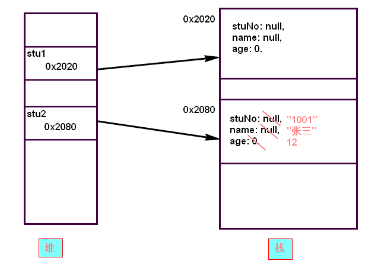
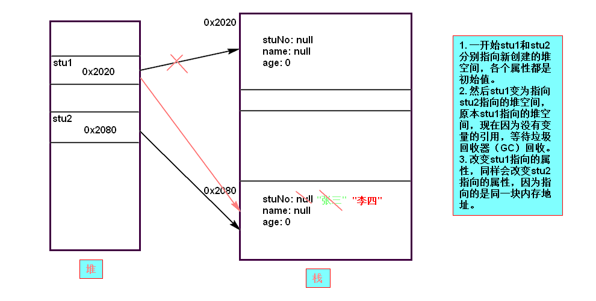

# 1 面向对象1

## 1.1 什么是面向对象

　　对象是具体存在的一个事物，即实体，类是某一种事物的抽象。比如每个人都是一个对象，“人”抽象成人类。要树立“万物皆对象”的概念。

　　可以用面向对象的方法编程，把一切都看作是对象，通过定义的类来创建对象。类就是用来描述该种对象所共同拥有的属性和方法。创建好对象后，就可以使用对象的方法和属性。这样，将我们从执行者变成了指挥者。

　　而面向过程强调的是过程。在以后的面向对象过程中我们能理解他的好处。

　　面向对象的开发：就是不断的创建对象，使用对象做事情。

　　面向对象的设计就是管理和维护对象之间的关系。

　　面向对象的特征就是封装，继承和多态。

　　用属性和行为描述一个现实的事物。通过面向对象实现现实生活的信息化。因为生活也是由一项项事物实体构成的。

## 1.2 创建和使用对象

　　首先需要定义一个类，类用来描述某种事物的属性和行为。用class关键字来定义一个类，比如现在要定义一个学生类，学生有学号、姓名等属性，学生有学习的行为：

　　新建一个Student.java文件，并写如下代码：

```java
public class Student {
    // class 定义一个类，在其中写属性和行为
    String stuNo; // 学号
    String name; // 姓名
    int age; // 年龄

    // 学习的行为
    public void learn() {
        System.out.println(name + "正在学习"); // 可以使用类中成员变量
    }
}

```

　　从上看到，属性就是类的成员变量，行为就是提供的方法，这里，方法不加上static关键字。

　　然后我们用这个类创建一个学生的对象，并给学生相关的属性赋值。类就相当于是一个模板，用new关键字创建一个对象。然后可调用其中的方法，使用其中的属性（成员变量）。

　　在Demo.java中写：

```java
public class Demo {
    public static void main(String[] args) {
        // 用new创建对象为stu，即stu类型是Student类
        Student stu = new Student();
        // 可以给各项属性赋值
        stu.stuNo = "1001";
        stu.name = "张三";
        stu.age = 12;
        stu.learn(); // 可调用方法
        // 可使用对象属性
        System.out.println(stu.stuNo);
        System.out.println(stu.name);
        System.out.println(stu.age);
    }
}

```

　　通过以上，知道了如何定义类、创建对象、使用对象（调用对象的成员使用.，比如stu.name，stu.learn()）。

## 1.3 对象是否“相等”和内存分析

　　运算符“==”用于两个对象（即引用类型）之间时，比较的是对象的内存地址是否相同，如果相同，才返回true。因此我们需要进行对象的内存分析。

　　案例1：创建两个对象。内存有栈内存和堆内存，划分在不同的区域。栈存储变量名，指向堆内存地址。一开始值是null（数值型是0），如果赋值的话，值就改变。

```java
public class Demo {
    public static void main(String[] args) {
        Student stu1 = new Student();
        Student stu2 = new Student();
        stu2.stuNo = "1001";
        stu2.name = "张三";
        stu2.age = 12;
    }
}

```

　　内存分析图：



　　所以说，两个对象，如果用==比较“相等”，返回的只是他们的内存地址是不是相等。所以上面的stu1==stu2返回的结果是false。

　　案例2：重新赋值会改变对象的指向。所以会改变指向后的对象的值。

```java
public class Demo {
    public static void main(String[] args) {
        Student stu1 = new Student();
        Student stu2 = new Student();
        stu2.name = "张三";

        stu1 = stu2; // 将stu1指向stu2;
        stu1.name = "李四"; // 改变stu1的name值
        // 输出stu2的name值发现变成李四了。
        System.out.println(stu2.name);
    }
}

```

　　分析图：



　　同样，最后比较stu1 == stu2时，返回的结果是true。那么我们想通过自己定义两个对象相等怎么办呢？也就是说，只要两个对象的姓名和年龄一样，就规定他们是“相同的”对象，就需要用到equals方法，这个以后讲。

　　所以以后要善于分析内存。

## 1.4 成员变量和局部变量

　　定义在类中的变量是成员变量；定义在方法中的变量是局部变量。需要注意他们的区别：

　　（1）作用域

　　　　成员变量在整个类内都有效；

　　　　局部变量只在其声明的方法内有效；

　　（2）生命周期

　　　　成员变量属于对象，它随着对象的创建而创建，随着对象的消失而消失；

　　　　局部变量在使用完后会马上释放空间，即调用方法时创建变量，方法结束后销毁变量（如果局部变量在大括号或for循环中，那么他的作用域和生命周期就在大括号和循环中，和C语言一样）；

　　（3）存储位置

　　　　成员变量属于对象，它存储在堆内；

　　　　局部变量存储在栈内存中，当不再使用时，马上就被释放；JVM会在栈内存中开辟一段空间用于存储运行每个方法需要的数据，这个空间就是方法栈。方法会在方法栈中执行，执行前压入栈，执行完弹出栈，对应的数据也会销毁。调试时可形象的看见入栈和出栈。

　　（4）初始值

　　　　成员变量如果没有赋初值，会有默认值，即：

　　　　　　byte、short、int和long类型默认是0；

　　　　　　char类型默认值是’\u0000’，啥也不显示。

　　　　　　boolean类型默认值是false；

　　　　　　对象类型默认值是null，包括数组、String和其他对象。

　　　　如果要想使用局部变量，则必须要先给局部变量一个初始值，否则不能使用。

　　有时有这样的情况，就是成员变量和局部变量的变量名是一样的，比如变量名都是name，则该类的这个方法中使用的就是局部变量name，如果想使用类的变量，则使用this关键字。this就表示是当前对象。

```java
public class Student {
    String stuNo;
    String name; // 姓名
    
    public void printName() {
        String name = "李四";
        System.out.println(name); // 直接用name得到的是局部变量name的“李四”
        System.out.println(this.name); // 使用this，就表示当前对象。因为这个对象是在外部创建的。
    }
}

```

## 1.5 对象的封装

　　上面的类都是没有经过封装的，是不规范的。封装有利于隐藏细节，增加安全性。比如没有封装之前，不能对成员变量的进行控制，如果用户对“性别”这一属性赋了一个非法的值，也无法判断。

　　因此，Java中的每个类都需要进行封装，要遵守以下规范：

　　所有的成员属性都用private修饰，然后为成员字段提供相应的get和set方法以便获取和设置成员属性。

　　一旦成员属性用了private修饰，类的外界就不能访问了，所以用 “get属性名”方法获取这个属性，用 “set属性名”方法设置这个属性，这样可以在set和get方法中做一些检验。对于boolean类型的属性，其get方法变为isXxx方法。

　　一个满足封装性规范的Java类如下所示：

```java
public class Student {
    private String stuNo;
    private String name;
    private int age;
    private boolean partyMember; // 是否是党员

    public String getStuNo() {
        return stuNo;
    }

    public void setStuNo(String stuNo) {
        // 由于在set方法中，形参名意义和属性意义相同，所以写同名即可，然后使用this，将设置的值赋值给类对应的成员变量。
        this.stuNo = stuNo;
    }

    public String getName() {
        return name;
    }

    public void setName(String name) {
        this.name = name;
    }

    public int getAge() {
        return age;
    }

    public void setAge(int age) {
        // 比如可以做一些数据合法性检查
        if(age > 120 || age < 0) {
            System.err.println("赋值失败，年龄设置不合法");
        }else {
            this.age = age;
        }
    }

    // boolean类型的是isXxx方法
    public boolean isPartyMember() {
        return partyMember;
    }

    public void setPartyMember(boolean partyMember) {
        this.partyMember = partyMember;
    }
}

```

　　使用时：

```java
public class Demo {
    public static void main(String[] args) {
        Student stu = new Student();
        // 这时不能直接使用里面的字段了，而是通过setXxx设置属性，通过getXxx获取属性值。
        stu.setName("张三");
        // 输出姓名
        System.out.println(stu.getName());
        // 以下设置年龄不合法会显示信息，并且年龄还是0
        stu.setAge(200);
        System.out.println(stu.getAge());

    }
}

```

　　这次也知道private和public的区别，public修饰的成员可以让外界访问，比如外界需要调用的方法，而private修饰的成员只能在类内部使用。

## 1.6 匿名对象

　　匿名对象就是直接new出来使用的对象，没有变量指向他。应用的场景是这个对象只需要使用一次。比如：

　　（1）使用一次某类的实例方法；

　　（2）直接作为参数传递给方法；

　　使用匿名对象的好处是使用完后可立即变为垃圾回收。

　　例子：new Student().learn(); 直接使用learn方法。

## 1.7 构造方法

　　构造方法用于对象的初始化。构造方法和类同名，无返回值，一般用public修饰构造方法。

　　构造函数是在对象建立时由JVM调用, 给对象初始化。

　　当类中没有定义构造函数时，系统会指定给该类加上一个空参数的构造函数。这个是类中默认的构造函数。当类中如果自定义了构造函数，这时默认的构造函数就没有了。

　　在一个类中可以定义多个构造函数，以进行不同的初始化。多个构造函数存在于类中，是以重载的形式体现的。

　　构造方法案例：

```java
public class Student {
    private String stuNo;
    private String name;
    private int age;

    // 构造方法用于初始化
    public Student(String stuNo, String name, int age) {
        this.stuNo = stuNo;
        this.name = name;
        this.age = age;
    }
    
    // 可以重载，只初始化部分属性
    public Student(String stuNo, String name) {
        this.stuNo = stuNo;
        this.name = name;
    }

    public String getStuNo() {
        return stuNo;
    }

    public void setStuNo(String stuNo) {
        this.stuNo = stuNo;
    }

    public String getName() {
        return name;
    }

    public void setName(String name) {
        this.name = name;
    }

    public int getAge() {
        return age;
    }

    public void setAge(int age) {
        this.age = age;
    }
}

```

　　使用对象时：

```java
public class Demo {
    public static void main(String[] args) {
        Student stu = new Student("1001", "张三", 12); // 用构造函数进行初始化
        // 输出
        System.out.println(stu.getStuNo());
        System.out.println(stu.getName());
        System.out.println(stu.getAge());

        // 不能再用Student stu1 = new Student()了，因为这个默认的无参构造已经不存在了。
    }
}
```

　　可以用Java提供的反编译工具验证一下，自己写了构造方法后，确实不再有默认无参的构造方法。反编译可以看到属性和方法：javap –private class字节码的类名，比如

　　javap –private Student

　　另外，还有更强大的Java反编译工具，比如[JD【点击去官网】](http://jd.benow.ca/ "官网")。可以将字节码或jar文件反编译成java文件。

## 1.8 this 关键字

　　据上所述，this指向的就是当前的对象。还可以用this调用本类的其他构造函数，减少重复代码。但是this不能嵌套调用本来的构造函数，那样会导致死循环，想想也不行。

```java
public class Student {
    private String stuNo;
    private String name;
    private int age;

    // 构造方法用于初始化
    public Student(String stuNo, String name, int age) {
        this.stuNo = stuNo;
        this.name = name;
        this.age = age;
    }

    // 可以重载，只初始化部分属性
    public Student(String stuNo, String name) {
        /*
        this.stuNo = stuNo;
        this.name = name;
        */
        // 上面两句就能写成，使用的是上面的三个参数的构造函数
        this(stuNo, name, 0);
    }

    public String getStuNo() {
        return stuNo;
    }

    public void setStuNo(String stuNo) {
        this.stuNo = stuNo;
    }

    public String getName() {
        return name;
    }

    public void setName(String name) {
        this.name = name;
    }

    public int getAge() {
        return age;
    }

    public void setAge(int age) {
        this.age = age;
    }
}

```

## 1.9 静态（static）成员

　　为什么要有static呢？分析一种情况，比如有个“中国人”类，需要记录对象的国籍信息。如果把“国籍”作为普通属性的话，那么每个创建出来的“中国人”对象都要存储一个“国籍”信息，显然是浪费的，因为都是“中国”。

　　为了解决此问题，优化内存，让所有的“中国人”对象都共享一个“国籍”属性，这样用static修饰的成员，就叫做静态成员。静态成员是随着类的加载而加载的，加载类的区域是“共享区”。使用到哪个类，就先要把这个类加载到共享区，创建其中的静态成员。

　　用static修饰的成员叫静态成员，没有用static修饰的成员是非静态成员，也叫实例成员。非静态成员需要创建对象来使用，静态成员直接使用类名调用即可，比如我们之前写的static方法，在本类中直接调用即可，在其他类中只需要加上类名即可。当然，静态成员也可以由对象来调用，但是不建议这么做，因为这样会混乱，毕竟静态成员是属于类的。

　　用static修饰的成员变量在类中是共享的，任意一个对象都可改变它的值。静态是随着类的加载而加载，前面不能用this关键字，不是创建对象时产生的。静态函数中不能访问非静态成员变量，只能访问静态变量；非静态函数可以访问静态变量。

　　因为static是随着类存在的，因此生命周期很长。类变量随着类的加载而加载存在于方法区中。

　　优缺点：静态成员能进行数据共享，可以节省内存空间；但是生命周期较长，并且有访问的局限性，只能访问静态资源。

## 1.10 静态应用和文档注释的使用

　　由于静态的方法可直接使用，一般将很多静态方法写在一个类中，将这个类作为工具类。

若不想这个类被创建对象而直接让人使用它的静态方法，则把类的构造函数设为private。
下面的工具类加入了文档注释，便于介绍类、方法和字段的含义，以及方法的参数和返回值。（先创建包com.zhang.tools）

```java
package com.zhang.tools;

/**
 * 对数组操作的工具类
 * @author zhang
 * @version 1.0
 * 
 */
public class ArrayTools {
    // 私有构造，不允许实例化
    private ArrayTools() {}

    /**
     * 打印数组
     * @param arr 要打印的数组
     */
    public static void printArray(int[] arr) {
        for(int i = 0; i < arr.length; i++) {
            System.out.println(arr[i]);
        }
    }

    /**
     * 返回数组中指定的元素
     * @param arr 数组
     * @param i 第几个元素
     * @return 数组元素
     */
    public static int get(int[] arr, int i) {
        return arr[i];
    }
}

```

　　说明：文档注释的第一行一般就是对类、方法的描述；

　　@param 参数名 对参数的描述

　　@return 对返回值的描述


　　上述类中有文档注释。为了别人使用方便，可以将文档注释生成javadoc文档，以API的形式展示，以便别人调用。生成javadoc的方法：使用javadoc命令

　　javadoc –d 生成的目录 –author –version –encoding 编码名称 java文件。比如：

　　javadoc –d . –author –version –encoding utf8 ArrayTools.java

　　-author和-version可以省略，就是说明是否显示作者和版本的。在Windows下，系统和Java默认编码是GBK，所以如果文件是UTF格式的，就需要加上-encoding utf8。想要生成文档，要求这个类必须是public声明的，否则报错。

　　知道了这些，再介绍API文档的使用。主要关注以下几点：

　　（1）java.lang包下的类不需要导入

　　（2）学习构造方法。若没有构造方法，则可能都是静态的。

　　（3）看成员方法：看是否静态(static)，什么类名（不是java.lang下面的话就需要导入类），方法名，参数。

## 1.11 main主方法详解

　　主函数的原型是：

　　public static void main(String[] args) {}

　　主函数是程序的入口，可以被jvm识别。程序中只能有一个主函数。

　　主函数说明如下：

　　public：函数的访问权限是public。

　　static：函数是静态的，主函数随着类加载。

　　void：主函数没有返回值。

　　函数的参数是String数组，即可以在命令行传递多个参数，然后可以用args拿到。

## 1.12 其他

　　（1）同一个文件夹下可以有多个java文件，对应多个Java类，可以互相调用其他的类。编译时只需编译你使用的JAVA文件，java自动编译所需要的其他JAVA文件。

　　（2）可以直接输出对象来初步判断这是什么类型的对象。下面是例子。
```java
public class Demo {
    public static void main(String[] args) {
        int[][] arr = {{1, 2, 3}, {4, 5}, {6}};
        System.out.println(arr);
        System.out.println(arr[0]);
        System.out.println(new Student("1001", "张三", 21));
    }
}

```

　　输出结果是：

```
[[I@28d93b30
[I@1b6d3586
Student@4554617c
9
```
