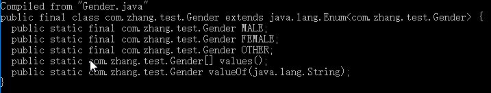

# 1. 图形用户界面（GUI）

　　Java也可以开发图形用户界面（Graphics User Interface）的程序。使用图形界面程序更直观、更方便，所见即所得。不过我们学习的重点不在于图形用户界面程序，而是以后的互联网开发。因此这里是少量涉及，介绍某几个重要概念。不过更适合开发桌面应用程序的还是C、C++和.Net，效率高。

## 1.1 概述

　　GUI中常用的类在下面的两个包中（这里不涉及JavaFX）：

　　（1）java.awt包：Abstract Window ToolKit (抽象窗口工具包)，通过调用本地系统方法实现功能，和操作系统关联较强，属重量级组件。虽然Java是跨平台的，但使用awt包创建GUI程序时，在不同平台下显示的效果是有差别的，因为依赖的是平台本身的组件。

　　（2）javax.swing包：在AWT的基础上，建立的一套图形界面系统，其中的图形组件完全由Java实现。这样swing包中就是和操作系统平台无关的图形组件了，使用swing能让GUI程序在不同平台上展示的效果相同。swing在javax包下，在JDK中，所有在javax中的包都是“扩展包”。

　　提倡多使用swing包下的图形组件。awt组件和swing组件的名称和使用方法是一致的，为了区分，swing中的所有类名前都加上了一个字母J。比如awt中的类Frame对应swing中的类JFrame。

　　几乎每个awt控件类都有对应的swing组件类，那么为什么不废除掉awt包呢？

　　原因有二：一是为了软件的兼容性；而是因为awt包中提供了事件处理(event)相关的类，这部分类并没有在swing中重新提供，因为各个平台的事件处理是有差异的，无法做到统一。

　　需要注意的是，图形界面不是学习的重点，重点在于其中的编程思想。


　　通过上图可知，所有的组件都继承自Component，Component下有两类组件，一类是容器组件（Container），一类是非容器组件（Button、Label等）。容器组件用于“装”非容器组件的，因此先学容器组件，再在容器中“装”非容器组件进行展示。

## 1.2 一个简单的窗体

　　用Frame类创建一个窗体。用setTitle()设置标题，用setSize()设置窗体大小等等。都可在API中查看。注意窗体默认是不显示的，需要调用setVisible()，设置可见性为true才能看到窗口。具体内容见代码：

```java
package com.zhang.test;

import java.awt.*;

public class Demo {
    public static void main(String[] args) {
        // 新建窗体对象
        Frame f1 = new Frame();
        f1.setTitle("第一个窗体"); // 设置标题
        f1.setSize(400, 300); // 设置窗体宽和高
        f1.setLocation(400, 200); // 设置窗体左上角坐标。
        f1.setBackground(Color.darkGray); // 设置背景颜色
        f1.setVisible(true); // 设置窗体显示
    }
}
```

　　其中setLocation(x, y)设置窗体左上角在屏幕中的坐标，那么坐标原点就是屏幕的左上角，向右是x轴，向下是y轴。setBackground中设置颜色，用Color对象中提供的默认变量即可。

　　实际上，setSize()方法中还能传递Dimension对象（尺寸对象），此对象实际就是封装了宽高属性；setLocation()方法中还能传递Point对象(坐标点对象)，此对象实际就是封装了x和y两个坐标值。例如：

```java
package com.zhang.test;

import java.awt.*;

public class Demo {
    public static void main(String[] args) {
        // 新建窗体对象
        Frame f2 = new Frame();
        f2.setTitle("第而个窗体");
        f2.setSize(new Dimension(400, 300));
        f2.setLocation(new Point(400, 200));
        f2.setVisible(true);
    }
}
```

　　还可以直接用setBounds方法一次性设置好窗体的大小和坐标。

```java
package com.zhang.test;

import java.awt.*;

public class Demo {
    public static void main(String[] args) {
        // Frame的构造可以直接设置标题
        Frame f3 = new Frame("这是第三个窗体");
        // 设置x, y, width, height
        f3.setBounds(400, 200, 400, 300);
        f3.setVisible(true);
    }
}
```

　　因此有时可多看看API，找到更好用的方法。

　　简单的窗体创建过程：Frame f = new Frame();f.setVisible(true);在显示之前可以设置标题、尺寸等。

　　有时，使用上面的awt包中类，显示中文有问题，可改用swing即显示正常。

## 1.3 设置窗体居中

　　窗体一般都是居中显示的，我们可设置窗体位置来让窗体居中。公式是（x, y） = （(屏幕宽度 - 窗体宽度) / 2, (屏幕高度 - 窗体高度) / 2）。

　　为了适应不同设备，我们需要获得设备的屏幕宽高（分辨率），用awt包下的ToolKit工具类。ToolKit是一个抽象类，但是它提供了一个getDefaultToolKit()方法来获得一个默认的工具箱。然后调用ToolKit对象的getSreenSize()方法即可得到Dimension对象。

　　例子：

```java
package com.zhang.test;

import javax.swing.*;
import java.awt.*;

public class Demo {
    public static void main(String[] args) {
        JFrame jFrame = new JFrame("我的窗体");
        jFrame.setSize(1200, 600);
        setFrameCenter(jFrame);
        jFrame.setVisible(true);
    }

    /**
     * 将窗体居中显示。窗体最好预先设置了宽高
     * @param jFrame 窗体
     */
    public static void setFrameCenter(JFrame jFrame) {
        // 先获得屏幕分辨率
        Toolkit toolkit = Toolkit.getDefaultToolkit();
        Dimension dimension = toolkit.getScreenSize();
        // 设置窗体居中
        int x = ((int)dimension.getWidth() - jFrame.getWidth()) / 2;
        int y = ((int)dimension.getHeight() - jFrame.getHeight()) / 2;
        jFrame.setLocation(x, y);
    }
}
```

## 1.4 事件监听机制

　　运行上面程序时，会发现点击窗体关闭按钮是没有反应的，只能在IDE中强制关闭程序（如果是JFrame，默认点击关闭按钮时，窗体会隐藏掉，但是程序还是没有被关闭，可在IDE中看到）。如果想让窗口关闭正常，那就就要进行事件处理。即要程序监听窗体关闭事件，并且程序要处理该事件。

　　在GUI中经常用到事件处理。事件处理有以下要点：

　　（1）拥有事件源，就是事件发生的地方，比如一个按钮。

　　（2）给事件源添加（注册）对某个事件的监听，这个事件是API定义好的，比如按钮点击事件、窗体关闭事件。

　　（3）给注册的监听事件编写事件处理，比如点击一个按钮要进行什么样的操作。

　　现在实现窗口的关闭。使用addWindowListener方法给事件源（即窗口）添加监听。此方法中传递一个WindowListener接口的实现类。此接口中就定义了窗体可以处理的各种事件。我们可以用匿名内部类。对于窗体关闭，我们只要处理WindowListener接口中的windowClosing事件，其他方法不需要实现。

```java
package com.zhang.test;

import java.awt.*;
import java.awt.event.WindowEvent;
import java.awt.event.WindowListener;

public class Demo {
    public static void main(String[] args) {
        // Frame的构造可以直接设置标题
        Frame f3 = new Frame("这是第三个窗体");
        // 设置x, y, width, height
        f3.setBounds(400, 200, 400, 300);
        f3.setVisible(true);
        f3.addWindowListener(new WindowListener() {
            @Override
            public void windowOpened(WindowEvent e) {
            }
            @Override
            public void windowClosing(WindowEvent e) {
                // 在此事件中关闭窗体。调用窗体对象的dispose()方法即可
                f3.dispose();
            }
            @Override
            public void windowClosed(WindowEvent e) {
            }
            @Override
            public void windowIconified(WindowEvent e) {
            }
            @Override
            public void windowDeiconified(WindowEvent e) {

            }
            @Override
            public void windowActivated(WindowEvent e) {
            }
            @Override
            public void windowDeactivated(WindowEvent e) {
            }
        });
    }
}
```

　　上面就是在窗体关闭事件中关闭窗体，最后，程序将执行结束。

　　在处理事件时，能通过事件对象WindowEvent拿到事件源等对象以便使用，例如，上述的windowClosing方法中可以这么写：

```java
@Override
public void windowClosing(WindowEvent e) {
    // 通过WindowEvent拿到事件源对象
    // 拿到的这个frame其实就是f3对象。
    Frame frame = (Frame) e.getSource();
    frame.dispose();
}
```

　　对于窗体关闭，JDK提供了更方便的方法，即调用setDefaultCloseOperation(int operation)方法即可实现关闭窗体。其中operation可以传递WindowConstants接口中提供的常量值，即DO_NOTHING_ON_CLOSE代表0，点击关闭时什么也不做；HIDE_ON_CLOSE代表1，即关闭时隐藏；DISPOSE_ON_CLOSE代表2，即关闭此窗口（若程序只剩下这一个窗口，就相当于关闭程序）；EXIT_ON_CLOSE代表3，即关闭此程序。Java中常用这些常量来限定某些参数值。这里常用的就是2和3（一般使用对应的常量名让代码更可读）。例子：

```java
jFrame.setDefaultCloseOperation(WindowConstants.DISPOSE_ON_CLOSE);
```

## 1.5 适配器Adapter

　　上面写事件处理时，要实现接口所有的方法，太麻烦。有什么方法能只要重写接口中的一个方法呢？这就通过适配器来实现。

　　实现适配器的步骤：

　　（1）首先定义好接口（上述程序中，此接口已经由JDK定义好）；

　　（2）用一个抽象类来实现此接口，实现接口的所有方法。注意是实现，里面可以不写什么，但是一定要实现。那么，当需要用到此接口的实现时，直接用此抽象类的实现类对象即可。此时，此抽象类的实现类需要重写什么方法，就重写什么方法，因为虽然是抽象类，但是他们都“实现”了，因此只要重写需要的方法即可。这样就实现了适配器，该抽象类就是适配器。

　　实际上对于WindowListener，JDK也写好了适配器WindowAdapter。

　　例子：

```java
package com.zhang.test;

import java.awt.*;
import java.awt.event.WindowAdapter;
import java.awt.event.WindowEvent;

public class Demo {
    public static void main(String[] args) {
        // Frame的构造可以直接设置标题
        Frame f3 = new Frame("这是第三个窗体");
        // 设置x, y, width, height
        f3.setBounds(400, 200, 400, 300);
        f3.setVisible(true);
        f3.addWindowListener(new WindowAdapter() {
            @Override
            public void windowClosing(WindowEvent e) {
                f3.dispose();
            }
        });
    }
}
```

　　当然，基本上JDK也都提供了事件处理配套的适配器，除非此事件处理接口只有一个方法。

　　其他例子：用户点击一下按钮，就改变窗体的背景颜色（红和绿）。

```java
package com.zhang.test;

import java.awt.*;
import java.awt.event.ActionEvent;
import java.awt.event.ActionListener;
import java.awt.event.WindowAdapter;
import java.awt.event.WindowEvent;

public class Demo {
    public static void main(String[] args) {
        Frame f = new Frame("背景变色");
        f.setBounds(400, 300, 400, 200);
        // 窗口关闭事件
        f.addWindowListener(new WindowAdapter() {
            @Override
            public void windowClosing(WindowEvent e) {
                f3.dispose();
            }
        });
        f.setBackground(Color.red);
        f.setVisible(true);
        //设置布局方式为流式布局，否则下面的按钮会占据整个区域（了解即可）
        f.setLayout(new FlowLayout());

        // 添加按钮
        Button btn = new Button("Change Background Color");
        f.add(btn); // 向窗体中添加按钮
        // 按钮点击事件 这个ActionListener就没有适配器
        btn.addActionListener(new ActionListener() {
            @Override
            public void actionPerformed(ActionEvent e) {
                if(f.getBackground() == Color.red) {
                    // 红色就绿
                    f.setBackground(Color.green);
                } else {
                    // 变红
                    f.setBackground(Color.red);
                }
            }
        });
    }
}
```

## 1.6 对话框

　　使用Dialog来弹出对话框。JDialog的构造函数是：JDialog(Frame owner, String title, boolean modal)。

　　owner表示对话框所属窗体，可以为空；

　　title表示对话框标题；

　　modal表示模式，若为true，则程序不允许操作主窗体，只能关闭此对话框才能操作，如果为false，则对话框和主窗体都能操作。例子：

```java
public static void main(String[] args) {
    JFrame jFrame = null;
    JDialog jDialog = new JDialog(jFrame, "欢迎", true);
    jDialog.setBounds(300, 200, 400, 300);
    jDialog.setVisible(true);
}
```

　　注意，不能直接使用new Dialog(null, “欢迎”, true)，因为JDialog还有一个构造参数为：

　　public JDialog(Dialog owner, String title, boolean modal)。如果直接传递null，会不知道具体使用哪个构造函数。因此可以用一个窗体或者Dialog类型“包装”null。

　　一般，经常用JOptionPane来弹出“实用”的对话框。

　　（1）消息对话框。

　　使用静态方法：showMessageDialog(Component parentComponent, Object message, String title, int messageType)。参数1是父容器，可为null，参数2是消息字符串，参数3是标题，参数4用来规定消息框的类型，可用JOptionPane中的静态常量表示，有：

　　ERROR_MESSAGE：错误对话框图标；

　　INFORMATION_MESSAGE：信息对话框图标

　　WARNING_MESSAG：警告对话框图标

　　QUESTION_MESSAGE：危险对话框图标

　　PLAIN_MESSAGE：无对话框图标

　　（2）确认对话框，使用方法：showConfirmDialog(Component parentComponent, Object message, String title, int optionType)。最后一个参数是确定对话框选项，查看文档即可知道传入参数。方法会根据用户选择的选项返回对应的数字，比如点击“是”则返回1。

　　（3）输入对话框：showInputDialog(...)，参数和上述方法类似，返回用户输入的值。若用户点击“取消”没有输入值，则返回值为null。

　　图形界面到此为止。可自行研究文件对话框、非容器组件、菜单和界面布局等内容。但是不建议深入研究，Oracle已经不再更新awt和swing了，有兴趣可了解下JavaFX。


# 2. JDK 5以来的一些简单新特性

## 2.1 静态导入（import static）

　　使用import时，还能使用import static直接导入其他类中的静态方法，这样，调用时直接写方法名即可，不用加上所在的类名。例如：

```java
package com.zhang.test;

// 静态带入Math类的pow方法
import static java.lang.Math.pow;

public class Demo {
    public static void main(String[] args) {
        // 计算2的3次方
        System.out.println(pow(2, 3));
    }
}
```

　　使用静态导入的前提是方法不能与本类静态方法同名，这和不能导入多个相同类名是一致的，因为这样JVM会不清楚究竟使用的是哪个类或者方法。这种情况只能写上类的全名。

　　一般情况下，也不会使用这种静态导入的方式。

## 2.2 增强for循环（for each）

　　引入增强for循环是为了简化数组和集合的遍历。for each的格式如下：

```java
for(数组或集合中元素数据类型 变量A : 需遍历的数组或即可) {
    此for循环中直接使用A元素，就是数组或集合中的单个变量
}
```

　　例子：用for循环遍历数组和集合。

```java
package com.zhang.test;

import java.util.ArrayList;

public class Demo {
    public static void main(String[] args) {
        String[] strArr = {"hello", "world", "java"};
        // 遍历
        for(String str : strArr) {
            System.out.println(str);
        }

        ArrayList<String> strList = new ArrayList<>();
        strList.add("hello");
        strList.add("world");
        strList.add("java");
        // foreach遍历
        for(String str : strList) {
            System.out.println(str);
        }
    }
}
```

　　可以看到使用for each后，遍历变得很简单。再比如Map集合的遍历：

```java
package com.zhang.test;

import java.util.HashMap;
import java.util.Map;

public class Demo {
    public static void main(String[] args) {
        Map<String, String> map = new HashMap<>();
        map.put("2016", "张三");
        map.put("2017", "李四");
        map.put("2018", "王五");
        // for遍历。实际上遍历的是entrySet()返回的Set集合。
        for(Map.Entry<String, String> entry : map.entrySet()) {
            System.out.println("键：" + entry.getKey());
            System.out.println("值：" + entry.getValue());
        }
    }
}
```

　　注意的是，在for each中，也不能对集合元素进行删除修改等操作，否则同样会出现并发修改异常。遍历过程中，对变量A进行修改的操作是不会对集合或数组生效的。

## 2.3 可变参数

　　定义方法时，若不能确定方法参数的个数，那么就可以使用可变参数。比如现在有个方法，用于求n个数的和，那么这个参数就是不确定的，可用可变参数。可变参数的格式是：

　　修饰符 返回值类型 方法名(形参类型... 形参变量名)

　　实际上可变参数就是用数组实现的，可变参数的形参就可当数组使用。只是传递时，既能接收多个参数，也能接收数组形式，比较方便。例如上述加法的实现：

```java
package com.zhang.test;

public class Demo {
    public static void main(String[] args) {
        // 可变参数的使用
        System.out.println(add(1, 2, 3));
        System.out.println(add(1, 2, 3, 4, 5));
        System.out.println(add(new int[]{1, 2, 3}));
    }

    public static int add(int ... nums) {
        int sum = 0;
        for(int num : nums) {
            sum += num;
        }
        return sum;
    }
}
```

　　需要注意的是，一个方法中只能有一个可变参数，并且可变参数必须是方法的最后一个参数。这是符合逻辑的，如果可变参数在其他位置，就无法判断可变参数长度截止到哪里。

　　实际上我们在Arrays类里学的asList方法就是可变参数，即：

　　public static <T> List<T> asList(T... a)。把数组转换成集合。

## 2.4 自动装箱和拆箱

　　这点在讲集合时已经提过。

## 2.5 枚举类型

　　在枚举类中可以列举出此枚举类包含的值，这样有利于代码的规范，避免接收错误数据。

　　比如在“性别”这个枚举类中定义了“男”、“女”和“其他”三个枚举值，那么我们定义一个方法设置一个人的性别时，让该方法只接收“性别”这个枚举类型，那么，传递进方法的数据只能是“男”、“女”或者“其他”，不可能是别的数据。

　　定义枚举类的格式（使用enum关键字）：

```java
修饰符 enum 枚举类型名{
枚举项1,
枚举项2,
...
枚举项n;
}
```

　　例如，定义的枚举类Gender为：

```java
package com.zhang.test;

public enum Gender {
    MALE,
    FEMALE,
    OTHER;
}
```

　　然后主类中有个方法接受此枚举类型并输出。main方法调用此方法：    

```java
package com.zhang.test;

public class Demo {
    public static void main(String[] args) {
        showGender(Gender.MALE);
    }

    public static void showGender(Gender gender) {
        System.out.println(gender);
    }
}
```

　　那么输出的直接是枚举项的字符串形式，即MALE。我们通过javap命令反编译Gender字节码文件，看看其中到底是什么。发现：



　　即枚举类其实也被是一个类，继承自Enum类，每个枚举值都是本类具体的对象，只不过是静态常量。并且枚举类提供了一些方法。

　　实际上我们可以在枚举类中写构造方法和成员。只是构造方法必须是私有的，在本类中使用，可以借此给枚举值设置一些信息。普通方法能在外界由各项枚举值使用，以此实现多种功能。

　　例如：

　　（1）修改的Gender枚举（各枚举项必须写在枚举类的开头位置）：

```java
package com.zhang.test;

public enum Gender {
    // 各项枚举值必须在开头位置
    MALE("男"),
    FEMALE("女"),
    OTHER;
    // 成员变量，表示各项枚举值的名字
    private String name;
    private Gender(){} // 无参构造
    // 带参构造
    private Gender(String name) {
        this.name = name;
    }
    // get set方法
    public String getName() {
        return name;
    }
    public void setName(String name) {
        this.name = name;
    }
}
```

　　（2）主类：

```java
package com.zhang.test;

public class Demo {
    public static void main(String[] args) {
        showGender(Gender.MALE);
    }

    public static void showGender(Gender gender) {
        System.out.println(gender);
        // 调用其中getName方法
        System.out.println(gender.getName());
    }
}
```

　　枚举类中可以有抽象方法，但是要由具体的枚举类实现。即要写成这样（匿名内部类形式），比如：

```java
package com.zhang.test;

public enum Gender {
    MALE() {
        @Override
        public String getInfo() {
            return "男";
        }
    },
    FEMALE() {
        @Override
        public String getInfo() {
            return "女"
        }
    },
    OTHER() {
        @Override
        public String getInfo() {
            return "其他";
        }
    };
    public abstract String getInfo();
}
```

　　然后主类也能调用枚举项的getInfo()方法。

　　枚举类继承了Enum类，查看Enum类API，发现以下实例方法很好用，可以被枚举项使用：

　　public final int ordinal()：返回该枚举类常量的序数，序数从0开始。

　　public final int compareTo(E o)：比较此枚举与指定对象的顺序。若相同返回0。只能与相同枚举类型的其他枚举常量进行比较。

　　当然，以前的equals()、toString()方法还是可用的。

　　Enum类还有一个静态方法valueOf：

　　public static <T extends Enum<T>> T valueOf(Class<T> enumType, String name)，此方法用于将字符串转换成枚举常量。比如：Gender male = Enum.valueOf(Gender.class, “MALE”)，此时male就是Gender.MALE枚举项。此方法的第二个参数就是传递Gender类的字节码。

　　JVM还会自动对所有枚举类插入两个静态方法：

　　（1）values()：获得此枚举类的所有枚举项的数组。比如：Gender[] gs = Gender.values()。

　　（2）valueOf(String name)：也是根据字符串获得对应的枚举项，只不过比Enum提供的方法简便，直接用Gender调用方法，不用传递Gender的字节码文件。即：Gender g = Gender.valueOf(“MALE”)。如果传递了枚举没有的字符串，那么这两个valueOf()方法都会抛出异常。

　　此外，枚举还能用在switch语句中。

## 2.6 数字字面量下划线

　　JDK 7后，数字的字面量中可以有下划线，此下划线作用是增强大数值的可阅读性，对实际数据值没有影响。例如：

```java
package com.zhang.test;

public class Demo {
    public static void main(String[] args) {
        int binary = 0b1000_0101_1010; // 二进制字面量
        int hex = 0x1031_FC21; // 十六进制字面量
        double decimal = 1000_3213_5.67; // 十进制字面量
        System.out.println(binary);
        System.out.println(hex);
        System.out.println(decimal);
    }
}
```

　　注意：下划线不能出现在进制标识和数值之间、不能出现在数值开头和结尾、不能出现在小数点旁边。

## 2.7 try-with-resources

　　try-with-resources用于对某些资源的自动释放。我们之前用的文件流都需要调用close()方法手动释放流对象。用try-with-resources这个特性后，流对象使用完后可以由程序自动释放。

　　try-with-resources的使用格式：

```java
try(需要自动释放的对象) {
    在此作用域中使用对象...
}
```

　　即把需要自动关闭的资源定义在try后的括号中（如果有多个资源，用分号分隔），然后只能在大括号的作用域内使用。这样资源就不需要我们主动关闭。

　　注意，必须是java.lang.AutoCloseable的实现类对象才能进行自动释放。也就是说，try小括号中的对象，它所在的类必须实现AutoCloseable接口。实际上，JDK中的流对象基本都实现了此接口（可以查看JDK 7及其以后的API文档），因此可以使用此特性进行自动释放资源。

　　例子：

```java
package com.zhang.test;

import java.io.File;
import java.io.FileInputStream;
import java.io.FileOutputStream;
import java.io.IOException;

public class Demo {
    public static void main(String[] args) throws IOException {
        copyFile(new File("e:\\VSCode.exe"), new File("d:\\vsc.exe"));
    }

    /**
     * 实现文件的拷贝。用try-with-resources特性
     * @param src 源文件
     * @param target 目标位置
     */
     public static void copyFile(File src, File target) throws IOException {
         try(FileInputStream fis = new FileInputStream(src); FileOutputStream fos = new FileOutputStream(target)) {
             byte[] buffer = new byte[1024];
             int length = 0;
             while((length = fis.read(buffer)) != -1) {
                 fos.write(buffer, 0, length);
             }
         }
     }
}
```

## 2.8 接口中的默认方法和静态方法

　　JDK 8中引入了此特性，即允许接口中有默认方法(default)和静态方法(static)，分别用default和static来修饰方法。理所当然，此时方法就不能再用abstract修饰了，并且方法应该有实现。

　　对于默认方法，如果实现类没有重写接口的默认方法，那么使用时就会调用默认方法；对于静态方法，直接由接口名.方法名调用。

　　例子：

　　（1）DemoInterface.java接口代码：

```java
package com.zhang.test;

public interface DemoInterface {
    // 静态方法
    public static void staticShow() {
        System.out.println("这是DemoInterface的静态方法");
    }
    // 默认方法
    public default void show() {
        System.out.println("这是默认方法");
    }
}
```

　　（2）实现类

```java
package com.zhang.test;

public class DemoImpl implements DemoInterface {
    // 这里可什么也不实现。
    // 当然也可以重写默认方法
}
```

　　（3）主类

```java
package com.zhang.test;

public class Demo {
    public static void main(String[] args) {
        // 可直接调用接口静态方法
        DemoInterface.staticShow();
        DemoInterface di = new DemoImpl();
        di.show(); // 调用的是默认方法
    }
}
```

