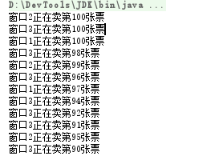

# 1. 进程和线程概述

　　每个运行的程序相当于一个“进程”，现在的操作系统是多进程的。比如我们可以同时运行“网易云音乐”和浏览器，边听歌曲边上网。其实CPU在某个时刻只能运行一个程序，只不过是操作系统在安排CPU频繁的切换所运行的进程，由于速度很快，所以人们感觉多个程序是同时进行的。

　　进程是系统进行资源分配和调用的一个基本单位，多进程提高了CPU的利用率。

　　而在一个进程中，又可以运行多个线程，这也是通过抢占CPU时间来运行的。我们以前写的程序只有一个执行流程，就是单线程程序。一个程序中也能“同时”进行多个执行流程，这就是多线程程序。比如一个安全软件能同时进行病毒查杀和电脑清理，是两个流程在“同时”进行，因此应用了多线程。

　　线程是依赖于进程的。对于开发者，主要考虑的是本程序的执行流程，也就是多线程。比如编写一个GUI程序，当进行到某一步时，此步骤需要执行大量计算并且耗时，如果使用单线程，那么界面此时是无响应的，必须等此步骤执行完毕，界面才有响应。若采用多线程，可另外开辟一个线程专门用于计算，此时该线程和界面线程抢占CPU时间，由于切换速度极快，因此用户不会感到界面无响应。

　　多进程和多线程都是并发，多进程是操作系统层面的并发，多线程是当前进程的并发，既然有并发，必然需要考虑处理多线程的“隐患”，比如线程安全、同步、死锁等问题，这个后面会讲（建议了解操作系统知识）。而对于开发者，考虑的主要就是本进程中的多线程。

# 2. 编写多线程程序

　　对于单线程程序，由java命令运行程序，运行程序时就启动JVM进程，接着由该JVM进程创建一个主线程调用main()方法。

　　在程序中创建新线程需要使用Thread类，通过查看此类的API，可知有两种方式创建新线程。下面进行讲解。

## 2.1 方式1：自定义类继承Thread类

　　通过自定义类继承Thread类实现多线程，步骤如下：

　　（1）新建类继承自Thread；

　　（2）重写run()方法，此方法中的代码就是该新线程需要执行的代码。

　　（3）需要创建并运行此线程时，就创建此类对象，并调用start()方法开始线程。这样新线程一旦获得CPU时间就会执行run()中的代码。

　　例子：

　　（1）自定义类继承Thread并重写run()方法。

```java
package com.zhang.test;

public class MyThread extends Thread {
    @Override
    public void run() {
        // 执行1000次输出
        for(int i = 0; i < 1000; i++) {
            System.out.println(i);
        }
    }
}
```

　　（2）主类创建多个线程

```java
package com.zhang.test;

public class Demo {
    public static void main(String[] args) {
        // 创建两个MyThread线程，让他们运行看效果
        MyThread t1 = new MyThread();
        MyThread t2 = new MyThread();
        t1.start();
        t2.start();
    }
}
```

　　运行结果发现，两遍0-999的数字很可能会交叉输出，这就是多线程。如果是单线程的话，必定是先输出完一遍0-999，再输出一遍0-999，而不会交叉输出。如果看不到交叉输出的效果，可把循环次数再变大，因为很可能CPU执行很快，在一个线程首次得到CPU时就把0-999全部输出完毕了。

　　注意启动线程调用的是start()方法，而不是run()方法，若调用run()方法，那么JVM认为这是一个普通的方法调用，是没有多线程效果的。注意，一个线程对象只能启用一次，即只能调用一次start()方法，若调用一次以上，就会抛出“IllegalThreadStateException”异常。

　　当然，可以直接用匿名内部类的方式创建并开始一个线程，例如：

```java
package com.zhang.test;

public class Demo {
    public static void main(String[] args) {
        new Thread() {
            @Override
            public void run() {
                System.out.println("我是一个新线程");
            }
        }.start();
    }
}
```

## 2.2 方式2：实现Runnable接口

　　此方法的步骤如下：

　　（1）定义一个类实现Runnable接口。同样重写其中的run()方法。

　　（2）用Thread类的一个重载创建对象，将Runnable接口实现类传递进Thread构造中。

　　（3）调用Thread对象的start()方法。

　　接口实现多线程的好处：避免由于Java单继承带来的局限性，这样可以使Runnable的实现类继承其他的类。使用第一种方式的话，自定义类只能继承Thread类了。

　　例子：

　　（1）MyThread实现Runnable：

```java
package com.zhang.test;

public class MyThread implements Runnable {
    @Override
    public void run() {
        for(int i = 0; i < 1000; i++) {
            System.out.println(i);
        }
    }
}
```

　　（2）主类

```java
package com.zhang.test;

public class Demo {
    public static void main(String[] args) {
        MyThread mt = new MyThread();
        Thread t1 = new Thread(mt); // 将Runnable实现类传递进去
        Thread t2 = new Thread(mt);
        // 启动
        t1.start();
        t2.start();
    }
}
```

　　也可以通过匿名内部类实现：

```java
package com.zhang.test;

public class Demo {
    public static void main(String[] args) {
        new Thread(new Runnable() {
            @Override
            public void run() {
                System.out.println("我是一个新线程");
            }
        }).start();
    }
}
```

　　那么就有个很有趣的问题，使用new Thread()方式，既能在括号中传递一个实现Runnable的匿名内部类，把new Thread看成对象，也能将new Thread()本身当做匿名内部类，重写run方法。即：

```java
package com.zhang.test;

public class Demo {
    public static void main(String[] args) {
        new Thread(new Runnable() {
            @Override
            public void run() {
                System.out.println("这是2");
            }
        }){
            @Override
            public void run() {
                System.out.println("这是1");
            }
        }.start();
    }
}
```

　　此时输出结果是“这是1”，因为start()还是被Thread的匿名内部类对象调用的，传递的Runnable匿名内部类没有什么作用。不过也没人用这种方式，只是好玩。

# 3. 线程常用方法

## 3.1 普通操作

　　（1）public static Thread currentThread()：静态方法，返回当前正在执行的线程对象。

　　（2）public final String getName()：获得线程名称。默认线程的名称是“Thread-序号”，序号是JVM定的。

　　（3）public final void setName(String name)：设置线程的名称。此方法应该在start()线程之前操作。

　　对于线程的名称，可在创建线程时就设置，因为有构造方法：

　　Thread()、Thread(Runnable target)、Thread(Runnable target, String name)、Thread(String name)。如果是自定义线程类，可以借用父类的Thread(String)构造。

　　例如：

```java
package com.zhang.test;

public class MyThread extends Thread {
    public MyThread(String name) {
        super(name);
    }
    @Override
    public void run() {
        System.out.println("此线程名称" + this.getName());
    }
}
```

　　然后MyThread也能通过new MyThread(“名字”)设置线程名了。若想获得主线程名，自然是通过Thread.currentThread().getName()的方式，主线程的名字就是“main”。

　　如果上述代码采用的是实现Runnable接口，就没法用this.getName()了，那么就用Thread.currentThread().getName()。

　　（4）设置和获取线程的优先级：

　　public final int getPriority()：获得线程优先级，默认是5，

　　public final void setPriority(int new Priority)：设置线程优先级。优先级从低到高可设置的范围是1-10。优先级就是一种抢占式调度模型，优先让优先级高的线程使用 CPU。

## 3.2 操作线程方法

　　（1）线程休眠：public static void sleep(long millis)：在指定的毫秒数内让当前正在执行的线程休眠（暂停执行），注意这是静态方法。

　　（2）设置后台线程（守护线程）：public final void setDaemon(boolean on)：如果设置为 true，则将该线程标记为守护线程。将该线程标记为守护线程或用户线程。当正在运行的线程都是守护线程时，Java 虚拟机退出。该方法必须在启动线程前调用。

　　守护进程就是在后台默默运行的线程，当所有的非后台线程结束时，程序也就终止了，同时还会杀死进程中的所有后台线程，也就是说，只要有非后台线程还在运行，程序就不会终止，执行main方法的主线程就是一个非后台线程。

　　如果不设置后台线程，那么就当所有的线程执行完后程序才结束。比如一个GUI程序，可能有很多后台线程，那么当主界面关闭后，程序就会终止，后台线程也会随着主线程关闭而被结束。如果此程序中都是用户线程，那么即使用户关闭了主界面，很可能程序也不会被关闭，还有线程在执行。这就是setDaemon()的特点。

# 4. 线程同步和锁

　　在多个线程使用到同一个资源时，就很可能有线程同步问题，这时我们可以用锁来解决。

　　现在看一个例子：现在有100张票，需要有3个窗口同时卖票。解决这个问题就需要使用多线程。线程的run()方法就用来处理每个线程的不断卖票。由于每个线程是一起卖100张票，因此不能把票数定义在方法中，而是把票数定义为线程类的静态变量。

　　例如：

　　（1）线程类：

```java
package com.zhang.test;

public class MyThread extends Thread {
    public MyThread() {}

    public MyThread(String name) {
        super(name);
    }

    // 票数
    private static int TICKET = 100;

    @Override
    public void run() {
        while(true) {
            if(TICKET > 0) {
                System.out.println(this.getName() + "正在卖第" + TICKET + "张票");
                TICKET--;
            }
        }
    }
}

为什么不用while(TICKET > 0)来判断呢？因为真正的逻辑是窗口一直卖票，只在卖的时候查看是否有票。如果用while(TICKET > 0)的方式，意思是只要现在大于0就一直卖票。那么下面用锁对象的时候，就会出现一个线程把所有的票都卖完。
```

　　（2）主类：

```java
package com.zhang.test;

public class Demo {
    public static void main(String[] args) {
        // 新建三个线程，争抢卖票
        MyThread t1 = new MyThread("窗口1");
        MyThread t2 = new MyThread("窗口2");
        MyThread t3 = new MyThread("窗口3");
        t1.start();
        t2.start();
        t3.start();
    }
}
```

　　多运行几次程序发现，有时程序一开始可能会卖多张相同的票。例如有这样的情况：



　　为什么会出现这种情况？多线程使用同一资源会出现这样的问题。比如当线程1执行完System.out.println()打印好卖的票时，此时CPU正好切换线程到线程2，此时线程1的TICKET--还没有执行，那么这样线程1和线程2以后就都会卖出第100张票。同样，还可能出现三个窗口同时卖出第100张票的情况。这个如果学习过操作系统有更多的同步问题、线程安全问题的理解。

　　如何解决上面的问题，可以用线程锁锁住使用的资源。使用线程锁有以下方式。


## 4.1 synchronized关键字

　　可以在类中定义一把锁，该锁可以是任何对象，但是要求对于每个线程，这个锁是相同的，因此还是可以用一个静态变量来定义一个锁。在进行相同资源操作期间，把这些操作的代码块放在sychronized锁中。也就是如果程序某个线程执行到了此代码块中，此资源立即被锁定，这时此资源只能被该线程使用，即使切换到了别的线程执行，发现这里是被锁住的，该线程就不能执行这里，除非原来的线程执行完了该代码块。

　　synchronized使用格式：

```java
synchronized(锁对象) {
    代码块
}
```

　　那么可将上述线程类代码修改成这样：

```java
package com.zhang.test;

public class MyThread extends Thread {
    public MyThread() {}

    public MyThread(String name) {
        super(name);
    }

    // 票数
    private static int TICKET = 100;
    // 锁
    private static final Object LOCK = new Object();

    @Override
    public void run() {
        while(true) {
            synchronized (LOCK) {
                if(TICKET > 0) {
                    System.out.println(this.getName() + "正在卖第" + TICKET + "张票");
                    TICKET--;
                }
            }
        }
    }
}
```

　　要看准synchronized代码所加的位置，不能加在if里面，那样什么效果也没有，因为验证已经进入了if中，也不能加在while外面，那样只会让一个线程卖完所有的票，因此需要考虑。加上了锁，如果线程1进入了锁代码块中，其他线程就不能进入了，只能等待。

　　当然，线程同步会影响效率。

　　同步方法：使用synchronized关键字修饰方法，使该方法成为一个同步方法，那么就不需要锁对象了。注意，synchronized只能修饰方法，不能修饰类和变量。

　　例如：

```java
package com.zhang.test;

public class MyThread extends Thread {
    public MyThread() {}

    public MyThread(String name) {
        super(name);
    }

    // 票数
    private static int TICKET = 100;

    @Override
    public void run() {
        while(true) {
            sellTicket();
        }
    }

    private synchronized void sellTicket() {
        if(TICKET > 0) {
            System.out.println(this.getName() + "正在卖第" + TICKET + "张票");
            TICKET--;
        }
    }
}
```

　　这样用了后，发现不行，还是会卖多个第100张的票。这是因为同步方法使用的是类的内置锁对象，而我们用继承Thread类方式实现线程，每个线程的创建都是new一个线程对象，所以每个线程对象的内置锁对象都是不一样的！因此使用synchronized同步方法时，最好使用实现Runnable接口的方式，创建多个线程时只用一个Runnable实现对象。即：

　　（1）线程类：

```java
package com.zhang.test;

public class MyThread implements Runnable {
    // 票数
    private static int TICKET = 1000;

    @Override
    public void run() {
        while(true) {
            sellTicket();
        }
    }

    private synchronized void sellTicket() {
        if(TICKET > 0) {
            System.out.println(Thread.currentThread().getName() + "正在卖第" + TICKET + "张票");
            TICKET--;
        }
    }
}
```

　　（2）主类

```java
package com.zhang.test;

public class Demo {
    public static void main(String[] args) {
        // 新建三个线程，争抢卖票
        MyThread t = new MyThread();
        Thread t1 = new Thread(t, "窗口1");
        Thread t2 = new Thread(t, "窗口2");
        Thread t3 = new Thread(t, "窗口3");
        t1.start();
        t2.start();
        t3.start();
    }
}
```

## 4.2 锁对象Lock

　　JDK5提供了一个新的锁对象Lock，可以更清晰的表达如何加锁和释放锁。Lock是一个接口，提供了获取锁lock()和释放锁unlock()的方法。

　　由于Lock是一个接口，所以我们使用它的实现类：ReentrantLock，音标[ri:'entrənt]。

　　例如：

```java
package com.zhang.test;

import java.util.concurrent.locks.Lock;
import java.util.concurrent.locks.ReentrantLock;

public class MyThread implements Runnable {
    // 票数
    private static int TICKET = 1000;
    // 创建锁对象
    private static final Lock LOCK = new ReentrantLock();

    @Override
    public void run() {
        while(true) {
            LOCK.lock(); // 加锁
            if(TICKET > 0) {
                System.out.println(Thread.currentThread().getName() + "正在卖第" + TICKET + "张票");
                TICKET--;
            }
            LOCK.unlock(); // 释放锁
        }
    }
}
```

# 5. 死锁

　　死锁是因线程间争夺资源产生的一种互相等待现象。比如线程A锁定了M资源，此时切换到线程B执行，线程B锁定了N资源，但同时线程B又需要M资源，由于M资源被A锁定，因此B线程等待A执行完释放资源。但是A执行过程中，同样需要N资源，此时N资源被锁，同样等待。至此，AB线程互相等待，产生死锁。如果出现了同步嵌套，就容易产生死锁问题。

　　例子（类似于哲学家就餐）：

```java
package com.zhang.test;

public class Demo {
    public static void main(String[] args) {
        // 假定中国人和美国人吃饭都需要“刀叉”和“筷子”。两种人吃饭是两个线程
        // 但是只有一个刀叉和一双筷子

        // 中国人吃饭线程
        new Thread(new Runnable() {
            @Override
            public void run() {
                synchronized ("刀叉") {
                    System.out.println("我要先拿住刀叉，不给别人");
                    synchronized ("筷子") {
                        System.out.println("我又拿到了筷子。吃完了就释放两个资源给别人使用");
                    }
                }
            }
        }, "中国人吃饭").start();

        // 美国人吃饭线程
        new Thread(new Runnable() {
            @Override
            public void run() {
                synchronized ("筷子") {
                    System.out.println("我要先拿到筷子，不给别人");
                    synchronized ("刀叉") {
                        System.out.println("我又拿到了刀叉。吃完了就释放两个资源给别人使用");
                    }
                }
            }
        }, "美国人吃饭").start();

    }
}
```

　　那么上述的程序可能会出现死锁，只是可能，不是一定。如果“中国”线程刚拿到刀叉，就切换到“美国”线程，那么两个线程就会各自拿着刀叉和筷子不放，但是双方想要吃饭必须得到两个资源，这是线程死锁，程序一直等待，就出现下面的死锁输出：

```
我要先拿到筷子，不给别人
我要先拿住刀叉，不给别人
```

　　有时没有出现死锁，则正常进行程序，要么中国人先吃，要么美国人先吃，比如这样的输出情况：

```
我要先拿住刀叉，不给别人
我又拿到了筷子。吃完了就释放两个资源给别人使用
我要先拿到筷子，不给别人
我又拿到了刀叉。吃完了就释放两个资源给别人使用
```

# 6. 线程组（ThreadGroup）

　　线程组可以对一批线程进行分类管理。默认情况下，线程是属于主线程组的。可以用Thread类的实例方法getThreadGroup得到一个线程的线程组对象：

　　public final ThreadGroup getThreadGroup()。

　　可以新建一个线程组对象，然后在新创建线程时，将线程设置到该线程组中以便统一管理。比如可用构造方法：

　　public Thread(ThreadGroup group, Runnable target, String name)，当然也有其他的构造方法。如果使用继承Thread类的方法，那么自定义线程类需要提供构造，调用Thread的构造方法来加入线程组。

　　下面是使用Runnable的例子，可以一起设置线程组的线程为后台线程（当然也有其他方法）。比如：

　　（1）Runnable实现类：

```java
package com.zhang.test;

public class MyThread implements Runnable {
    @Override
    public void run() {
        System.out.println("线程：" + Thread.currentThread().getName());
    }
}
```

　　（2）主类

```java
package com.zhang.test;

public class Demo {
    public static void main(String[] args) {
        // 先看看主线程所在的线程组名称
        System.out.println(Thread.currentThread().getThreadGroup().getName());// 在主线程组main
        // 创建线程组，指定名称
        ThreadGroup group = new ThreadGroup("tg1");
        // 新创建线程加入到线程组
        Thread t1 = new Thread(group, new MyThread(), "线程1");
        Thread t2 = new Thread(group, new MyThread(), "线程2");
        // 同时设置为后台线程
        group.setDaemon(true);
        t1.start();
        t2.start();
    }
}
```

# 7. 线程池

　　JDK提供了线程池，线程池中存放的是刚运行的线程。当一个线程需要多次运行时，使用线程池将提高效率。

　　使用Executors工程类来创建线程池，常用的方法有：

　　（1）public static ExecutorService newCachedThreadPool()：创建一个具有缓存功能的线程池；

　　（2）public static ExecutorService newFixedThreadPool(int nThreads) ：创建一个可重用的，具有固定线程数的线程池，此方法最常用；

　　（3）public static ExecutorService newSingleThreadExecutor()：创建一个只有单线程的线程池，相当于将上个方法的参数设置为1。

　　上述方法的返回值都是ExecutorService对象，该对象表示一个线程池。ExecutorService对象提供了实例方法submit()来执行线程任务，其中一个重载是：

　　Future<?> submit(Runnable task)，即此方法能执行Runnable实现类对象的线程任务。

　　例子：

　　（1）MyRunnable类：

```java
package com.zhang.test;

public class MyRunnable implements Runnable {
    @Override
    public void run() {
        System.out.println("执行线程任务");
    }
}
```

　　（2）主类：

```java
package com.zhang.test;

import java.util.concurrent.ExecutorService;
import java.util.concurrent.Executors;

public class Demo {
    public static void main(String[] args) {
        // 创建线程数为2的线程池.
        ExecutorService pool = Executors.newFixedThreadPool(2);
        // 使用线程池执行Runnable任务
        pool.submit(new MyRunnable());
        pool.shutdown(); // 必须调用此方法结束线程池，否则程序不会退出
    }
}
```

　　submit方法还有重载：

　　<T> Future<T> submit(Callable<T> task)，说明submit也能执行Callable实现类对象的任务。这其实也算作创建线程的第三种方式：就是通过线程池执行Callable任务。

　　Callable也是接口，只不过重写的是call()方法，Callable可以当做Runnable使用。特点是：执行Callable任务是可以有返回值的，Callable有泛型，Callable使用什么样的泛型，call()方法就返回什么类型，并且这时submit的返回值Future也有泛型。Future中可以获得Callable任务得到的数据。

　　如果只是实现和Runnable一样的功能，直接call返回null即可，这里就不讲了，这里主要将获得Callable任务的返回数据。例子如下：

　　（1）MyCallable类：

```java
package com.zhang.test;

import java.util.concurrent.Callable;

public class MyCallable implements Callable<String> {
    @Override
    public String call() throws Exception {
        System.out.println("我返回的是字符串100");
        return "100";
    }
}
```

　　（2）主类：

```java
package com.zhang.test;

import java.util.concurrent.ExecutionException;
import java.util.concurrent.ExecutorService;
import java.util.concurrent.Executors;
import java.util.concurrent.Future;

public class Demo {
    public static void main(String[] args) throws ExecutionException, InterruptedException {
        // 创建线程池
        ExecutorService pool = Executors.newFixedThreadPool(2);
        Future<String> f = pool.submit(new MyCallable());
        // 用get方法得到结果
        System.out.println(f.get());
        // 结束线程
        pool.shutdown();
    }
}
```

　　上面只是得到任务的结果数据。还可以利用Callable实现类的构造函数接收传递进线程的数据，实现互相传递数据。

　　例子：

　　（1）MyCallable类：

```java
package com.zhang.test;

import java.util.concurrent.Callable;

public class MyCallable implements Callable<String> {
    private String data; // 接收数据的变量
    // 用构造函数接收数据
    public MyCallable(String data) {
        this.data = data;
    }
    @Override
    public String call() throws Exception {
        System.out.println("我把接收的数据再返回去");
        return data;
    }
}
```

　　（2）主类：

```java
package com.zhang.test;

import java.util.concurrent.ExecutionException;
import java.util.concurrent.ExecutorService;
import java.util.concurrent.Executors;
import java.util.concurrent.Future;

public class Demo {
    public static void main(String[] args) throws ExecutionException, InterruptedException {
        ExecutorService pool = Executors.newFixedThreadPool(2);
        Future<String> f = pool.submit(new MyCallable("hello world"));
        System.out.println(f.get());
        pool.shutdown();
    }
}
```

# 8. 定时器

　　定时器可用于调度多个定时任务以后台线程的方式执行。在Java中，可以通过Timer和TimerTask类来实现定时调度的功能。

　　首先自定义类继承自TimerTask类，重写run()方法，方法里面就写定时需要执行的任务。并且类中需要接收一个Timer对象，因为Timer对象有cancel()方法，只有在run()方法中调用cancel()方法，此任务才会结束。

　　这个Timer就是外界传递过来的，并且就是这个外界的Timer对象调用schedual()方法来执行此定时任务。schedual方法有下面参数：

　　（1）public void schedule(TimerTask task, long delay)：延迟delay毫秒后结束任务。TimerTask子类需要接收Timer调用cancel()方法。

　　（2）public void schedule(TimerTask task, long delay, long period)：每隔一段时间，并延迟delay毫秒就执行task任务，这是是连续执行，所以不需要传递Timer进来调用cancel()方法。

　　当然，schedual重载还能传递Date对象，指定特定时间执行任务。

　　定时执行一次的例子：

　　（1）自定义类：

```java
package com.zhang.test;

import java.util.Timer;
import java.util.TimerTask;

public class MyTask extends TimerTask {
    private Timer timer;
    public MyTask(Timer timer) {
        this.timer = timer;
    }
    @Override
    public void run() {
        System.out.println("这是自定义定时任务");
        // 完成，关闭
        timer.cancel();
    }
}
```

　　（2）主类：

```java
package com.zhang.test;

import java.util.Timer;

public class Demo {
    public static void main(String[] args) {
        // 创建Timer对象
        Timer timer = new Timer();
        // 延迟1秒执行
        timer.schedule(new MyTask(timer), 1000);
    }
}
```

　　定时执行多次的例子：

　　（1）自定义类：

```java
package com.zhang.test;

import java.util.TimerTask;

public class MyTask extends TimerTask {
    @Override
    public void run() {
        System.out.println("这是自定义定时任务");
    }
}
```

　　（2）主类：

```java
package com.zhang.test;

import java.util.Timer;

public class Demo {
    public static void main(String[] args) {
        // 创建Timer对象
        Timer timer = new Timer();
        // 每隔1秒执行一次
        timer.schedule(new MyTask(), 0, 1000);
    }
}
```

　　Quartz是一个完全由java编写的开源调度框架。有空可学习。

