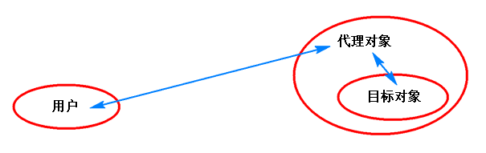

代理（Proxy）

# 1. 引入

## 1.1 问题

　　有时，功能代码写完后，根据需求的变化，常会扩展功能，例如如下类的“功能”代码：

```java
package com.company;

public class Greeting {
    public void sayHello() {
        System.out.println("hello world.");
    }
}
```

　　如果现在要求你为该方法增加统计执行时间的功能，你只能修改代码：

```java
public void sayHello() {
    long startMillis = System.currentTimeMillis();
    System.out.println("hello world.");
    System.out.println("方法耗时：" + (System.currentTimeMillis() - startMillis) + "毫秒");
}
```

　　但如果有一天又要你添加其他的功能或者让你移除一些功能，则又要找到此处代码进行修改。

　　这时可以考虑使用代理来实现上面的功能。

## 1.2 代理模式

　　代理是一种设计模式，即通过代理对象访问目标对象。示意图如下：



　　使用代理的好处是：能修改或扩展目标对象的功能。如果使用代理模式，则用户实际访问的是代理对象，代理对象根据实际需求调用目标对象，实现提供额外的功能。例如1.1节中的问题，本来的代码已经实现好了业务功能，而后面的需求只是对方法要求的扩展功能，根据OOP设计的“开闭原则”：即类对于修改是关闭的，而对扩展是开放的。若我们直接修改目标对象的代码，则可能导致其他相关代码出现异常。因此我们考虑的是扩展类方法的功能的方法。

　　总而言之，代理的目的是构建一个代理类，该代理类能修改和扩展原有类的方法，最终用户使用代理类实现扩展的功能。

# 2. 代理的实现

　　代理模式分为静态代理和动态代理，其中每种方式中，根据目标对象是否实现了接口，又有不同的处理方式。下面进行详细讲解。

## 2.1 静态代理

　　静态代理是指程序运行前就已经存在代理类的字节码文件，代理类和委托类（即目标对象的类）的关系在运行前就确定了。

### 2.1.1 使用接口实现代理

　　如果委托类是实现了某个接口的，则我们可使用接口进行代理。此方式实现代理的原理是：委托类和代理类要实现相同的接口，且代理类中维护一个委托类的对象，然后代理类实现接口中的方法，那么此时代理类就可在调用委托类对象方法的基础上进行功能修改或者扩展。

　　下面是例子。例如有一个Student接口，提供了study方法：

```java
package com.company;

public interface Student {
    void study();
}
```

　　GoodStudent类（委托类）实现了该接口：

```java
package com.company;

public class GoodStudent implements Student {
    @Override
    public void study() {
        System.out.println("好好学习");
    }
}
```

　　现在我们新建一个代理类，来实现代理委托类。其实此时的步骤和装饰模式的步骤很相似，使用的口诀如下（也适用于装饰模式）：

　　（1）编写一个类，实现与被装饰类（委托类）相同的接口。目的是使他们有相同的行为。

　　（2）定义一个实例变量，引用被装饰对象（目标对象）。目的是和目标对象进行交接。

　　（3）定义构造方法，把被装饰对象（目标对象）注入进来。

　　（4）对于不需要改写的方法，调用被装饰对象（目标）的。

　　（5）对于要改写的方法，改写即可。

　　因此代理类GoodStudentProxy实现如下（增加记录执行时间的功能）：

```java
package com.company;
// 1. 实现与委托类相同的接口。
public class GoodStudentProxy implements Student {
    private Student student; // 2. 定义一个实例变量，引用目标对象。这里直接使用接口类型，通用。
    // 3. 使用构造函数将目标对象注入进来。
    public GoodStudentProxy(Student student) {
        this.student = student;
    }
    // 重写方法。
    @Override
    public void study() {
        long startMillis = System.currentTimeMillis();
        student.study(); // 可执行目标对象的方法。
        System.out.println("方法耗时：" + (System.currentTimeMillis() - startMillis) + "毫秒");
    }
}
```

　　当然，如果要彻底“颠覆”委托类的执行方法，重写时不调用目标对象方法即可。

　　最后，使用代理类对象：

```java
@Test
public void testTransfer() {
    Student student = new GoodStudentProxy(new GoodStudent());
    student.study();
}
```

### 2.1.2 使用子类实现代理

　　如果委托类没有实现接口，如何实现代理呢？

　　例如现在直接有一个Teacher类：

```java
package com.company;

public class Teacher {
    public void teach() {
        System.out.println("正在讲课");
    }
}
```

　　那么想要为无接口的类实现代理，则使用继承的方式实现，即使用子类（代理类）覆盖父类（委托类）的方法，进而实现修改和扩展方法。因为通过继承，子类会拥有父类的行为。

　　因此，我们编写的TeacherProxy代理类如下：

```java
package com.company;

public class TeacherProxy extends Teacher {
    @Override
    public void teach() {
        long startMillis = System.currentTimeMillis();
        super.teach(); // 可执行目标对象的方法。
        System.out.println("方法耗时：" + (System.currentTimeMillis() - startMillis) + "毫秒");
    }
}
```

　　使用如下：

```java
@Test
public void testTransfer() {
    Teacher teacher = new TeacherProxy();
    teacher.teach();
}
```

　　实际中，到底使用接口代理还是子类代理，要看实际情况，如果委托类没有实现接口，则需要使用子类代理，但是子类代理也有限制，它要求委托类不能被final修饰。

## 2.2 动态代理

　　上面的静态代理有什么缺点呢？

　　（1）静态代理会产生代理类，如果多处需要代理，则也会产生很多代理类；

　　（2）代码不够简洁灵活，不好维护。例如基于接口的静态代理，则代理类要实现接口中的所有方法，如果接口中有很多方法，则全都要实现，而有时代理类只想扩展其中某个方法，导致代码重复。

　　因此我们考虑使用动态代理，这在实际开发中很常用。什么是动态代理？和静态代理通过自己编写代理类的方式不同，动态代理就是在程序运行时在内存中动态地构建生成代理对象。也就是说，动态代理的代理对象是在程序运行时自动生成的。但动态代理和静态代理都能实现在不修改委托类的前提下扩展功能，而且动态代理更灵活。

　　在动态代理中，只要开发者定义了要动态代理的具体内容，那么程序运行就会自动生成一个实现该功能的代理对象，达到和静态代理实现相同的效果。同样，动态代理也分为基于接口的动态代理和基于子类的动态代理。

### 2.2.1 基于接口的动态代理

　　JDK本身提供了基于接口的动态代理（因此又叫JDK代理），我们利用Proxy类提供的静态方法newProxyInstance()来创建基于接口的代理对象。方法原型如下：

```java
public static Object newProxyInstance(ClassLoader loader,
                                      Class<?>[] interfaces,
                                      InvocationHandler h);
```

　　其中的参数和返回值含义如下：

　　参数1指定目标对象使用的类加载器。

　　参数2指定目标对象实现的接口类型。由于委托类有可能实现多个接口，因此使用Class数组。

　　上述两个参数一般都是固定写法，就是使用目标对象的类加载器和接口类型。

　　参数3中，InvocationHandler是一个接口，因此参数3需要传递一个该接口的实现类对象。其实这里使用了策略设计模式，该参数用来说明生成的代理类的具体代理工作，由于Proxy.newProxyInstance()方法也无法知道代理类需要做什么工作，而只有调用者知道，因此这里要求传递一个接口实现类对象，由这个接口实现类对象定义代理的具体工作（该接口实现类相当于制定具体的策略）。

　　返回值：该返回值是Object类型，其实返回的就是代理对象，一般将此返回值强转成代理的接口类型使用。

　　因此如果我们使用动态代理来代理GoodStudent对象的话，则可直接写类似下面的代码，而不用新建代理类：

```java
@Test
public void testTransfer() {
    Student student = new GoodStudent(); // 目标对象
    // 下面使用动态代理创建代理对象。
    // 参数1和参数2分别传递目标对象的类加载器和接口类型；参数3传递的是InvocationHandler实现类
    Student studentProxy = Proxy.newProxyInstance(student.getClass().getClassLoader(),
            student.getClass().getInterfaces(),
            InvocationHandler的实现类
    ); // newProxyInstance的返回值就是代理对象
    studentProxy.study(); // 调用代理对象的方法
}
```

　　我们希望上面的代码执行studentProxy.study()时能代理统计执行时间，因此现在的工作是写好InvocationHandler实现类，因为该实现类就是告诉newProxyInstance方法如何进行代理。

　　那么InvocationHandler接口里面有什么呢？InvocationHandler接口中只有一个invoke方法，这就是我们需要实现的。该方法就用于定义代理类的具体执行代码。JDK的InvocationHandler代码如下：

```java
package java.lang.reflect;

public interface InvocationHandler {
    public Object invoke(Object proxy, Method method, Object[] args)
        throws Throwable;
}
```

　　为什么在newProxyInstance()传递InvocationHandler的实现类能实现代理呢？因为当执行newProxyInstance返回的代理对象的任何方法时，都会执行传递进去的InvocationHandler实现类的invoke方法，而在invoke方法参数中能拿到原目标对象的对应的方法和参数，因此能实现修改和扩展目标对象的方法以实现代理。

　　所以这里还要知道invoke()方法的参数和返回值的含义：

　　参数1：表示当前代理对象的引用。开发者不要去使用它，否则可能导致死循环（因为调用代理对象的方法又会进入invoke方法，如此循环）。

　　参数2：表示当前执行的方法。

　　参数3：表示当前执行的方法用到的参数。

　　返回值：返回值是Object类型，只要返回当前调用的方法的返回值即可，如果没有就返回null。

　　因此，我们把上面的代码写完全，使用动态代理为GoodStudent的study方法添加统计执行时间的功能：

```java
package com.company;
import org.junit.Test;

import java.lang.reflect.InvocationHandler;
import java.lang.reflect.Method;
import java.lang.reflect.Proxy;

public class AppTest {
    @Test
    public void testTransfer() {
        Student student = new GoodStudent(); // 目标对象
        // 动态代理
        Student studentProxy = (Student) Proxy.newProxyInstance(
                student.getClass().getClassLoader(),
                student.getClass().getInterfaces(),
                new InvocationHandler() {
                    @Override
                    public Object invoke(Object proxy, Method method, Object[] args) throws Throwable {
                        // 如果执行的是study方法，则统计执行时间
                        if ("study".equals(method.getName())) {
                            long startMillis = System.currentTimeMillis();
                            method.invoke(student, args); // 执行原目标对象的方法
                            System.out.println("方法耗时：" + (System.currentTimeMillis() - startMillis) + "毫秒");
                        } else {
                            // 如果是其他方法，直接执行原来目标对象的方法，不做任何处理。
                            return method.invoke(student, args);
                        }
                        return null;
                    }
                }
        );
        studentProxy.study(); // 调用代理对象的方法
    }
}
```

　　以上我们就实现了一个简单的动态代理。

### 2.2.2 基于子类的动态代理（cglib实现）

　　基于子类的动态代理适合于委托类没有实现接口的情况。基于子类的动态代理需要借助第三方类库，该类库是cglib。   这里我们借助第三方的CGLIB工具实现子类动态代理，使用子类作为代理类。

　　cglib动态代理也是在内存中构建一个子类对象从而实现对目标对象功能的扩展。cglib的包可在网址：　https://github.com/cglib/cglib/releases　 上下载。我们这里使用的是“cglib-nodep-3.2.5.jar”，注意这里选择的是带有“nodep”字样的包，这是不需要其他依赖包的jar包。使用时，直接将该包引入项目即可。

　　使用cglib实现基于子类的动态代理，用法和使用JDK代理基本一致，可使用Enhancer类的静态方法create，其原型为：

```java
public static Object create(Class type, Callback callback);
```

　　参数1：指定目标对象的的字节码对象，即父类（被代理类）的字节码。

　　参数2：Callback是一个接口，这里传递该接口的实现类对象，其实这也是使用策略模式，在接口实现类对象中指明代理的具体工作。所以说使用方法和JDK代理大同小异。

　　返回值：返回值是Object类型，就是返回一个代理类对象，使用时强转为委托类类型即可。

　　同样，现在需要具体了解下参数2callback传递什么，我们这里传递一个MethodInterceptor的匿名内部类。MethodInterceptor是继承了Callback接口的一个接口，所以可以将该匿名内部类传递进去。MethodInterceptor中需要实现一个方法：

```java
Object intercept(Object proxy, Method method, Object[] args, MethodProxy methodProxy) throws Throwable;
```

　　和JDK代理中InvocationHandler的invoke()方法类似，这里面的intercept方法也在每次调用代理对象的任何方法时被执行，且参数含义如下：

　　参数1：表示当前代理对象的引用。开发者不要去使用它。

　　参数2：表示当前执行的方法。

　　参数3：表示当前执行的方法用到的参数。

　　参数4：暂时没有用到，不清楚。

　　返回值：返回值是Object类型，只要返回当前调用的方法的返回值即可，如果没有就返回null。

　　所以说这里cglib的使用和JDK代理的使用非常相似。因此这时我们使用动态代理为Teacher类的所有方法添加统计时间的功能：

```java
@Test
public void testTransfer() {
    Teacher teacher = new Teacher(); // 目标对象
    // 使用cglib的动态代理
    Teacher teacherProxy = (Teacher) Enhancer.create(teacher.getClass(), new MethodInterceptor() {
        @Override
        public Object intercept(Object proxy, Method method, Object[] args, MethodProxy methodProxy) throws Throwable {
            // 这里不区分方法了，直接给每个方法添加统计执行时间功能。
            long startMillis = System.currentTimeMillis();
            Object rtValue = method.invoke(teacher, args); // 可执行目标对象的方法。记录返回值
            System.out.println("方法耗时：" + (System.currentTimeMillis() - startMillis) + "毫秒");
            return rtValue; // 将返回值返回
        }
    });
    teacherProxy.teach(); // 调用代理对象的方法
}
```

　　当然，使用动态代理时，委托类也不能是用final修饰的类。

# 3. 代理的应用

　　在目前的Java SE阶段还没有实际的令人印象深刻的应用代理的案例。但代理的知识非常重要，在以后的Java EE阶段，常会用到代理模式。

　　例如我们会在以后编写数据库连接池代码时，应用代理解决难点问题。另外，Java EE中学习的Spring框架是非常重要的Java EE框架，该框架的核心之一就是基于代理实现的AOP（面向切面编程），Spring提供了非常方便灵活的AOP编程。

# 4. 感悟总结

　　我们可以感受到，代理能起到拦截方法的作用。在动态代理中，它类似于在程序运行时动态改变对象原本的执行效果，好像运行时修改了程序代码一样。

　　代理意味着“找别人帮你做事情”，这意味着在程序中，如果一个对象被代理了，则原对象的方法就可能被增强或者篡改，因为代理是可以在其过程中“做手脚”的。