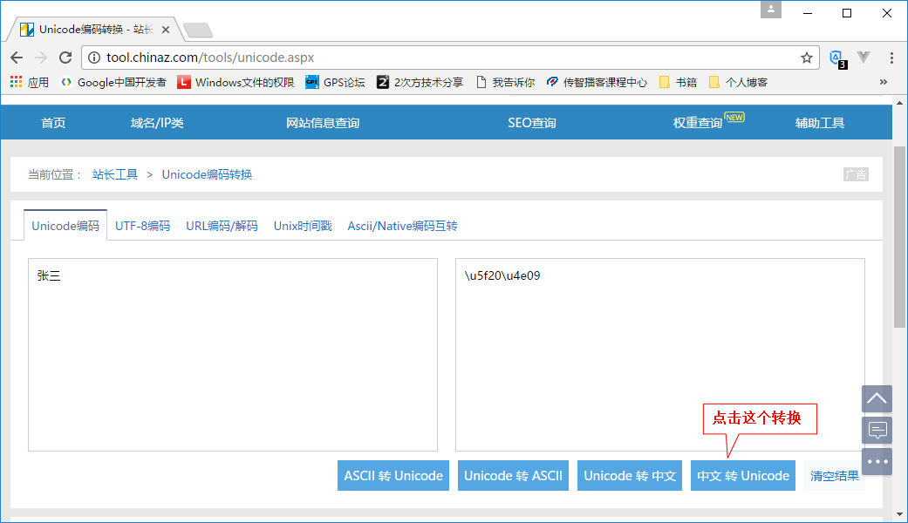

# 1. 反射

## 1.1 类的加载

　　学习反射之前先研究一个Java类的加载。

　　程序运行过程中，当需要使用到一个类时，如果该类还未被加载到内存中，则JVM会将此类的class字节码文件读入内存，并为此类创建一个Class对象（注意：此Class是JDK定义的一个类，不能和小写的class混淆）。任何类被使用时系统都会建立一个Class对象，此Class对象中就包含了该类的信息。

　　当创建一个类的对象、使用类的静态成员、创建该类的子类和用java命令执行此主类等情况时，都可能会进行该类的加载，因为只要是初次使用就要加载该类。

　　加载类时会创建对应的Class对象，这是学习的重点。而类加载器的作用就是将class字节码文件加载到内存中，并为之创建对应的Class对象。有以下类加载器：

　　（1）Bootstrap ClassLoader：引导类加载器，也叫根类加载器，负责Java核心类的加载，如System、String类等。这些类的字节码文件被打包存放在rt.jar文件中。此文件在：JDK目录/jre/lib目录下。

　　（2）Extension ClassLoader：扩展类加载器，负责扩展类的加载，就是加载JDK/jre/lib/ext目录中jar包里的字节码文件。

　　（3）System ClassLoader：系统类加载器，负责加载本应用的主类（即通过Java命令执行的主类）和classpath所指定的jar包和类的字节码文件。总之此加载器负责加载程序本身和程序引入的JAR包和字节码文件，因为这也是通过classpath指定的。

## 1.2 使用反射

　　反射就是通过类的Class字节码对象，来获得此类的信息。通过反射，能够知道该类的所有属性和方法（包括私有的）。这样，可利用反射动态的获取类的信息并加以利用。

### 1.2.1 获得类的字节码对象

　　要想使用反射，首先要获得类的字节码对象。有三种方式获得类的字节码对象：

　　（1）调用该类的一个实例的方法：getClass()。此方法是Object提供的，因此可用此方式获得大部分类的字节码对象。

　　（2）使用类的静态属性class获得字节码对象。任何类型都有class属性，比如：int.class即可获得int类型的字节码对象。

　　（3）使用Class类中的静态方法：public static Class<?> forName(String className)。此方法可通过类名字符串（要使用类名的全路径）来加载类并获得此类的Class对象。

　　开发中，常用的就是用第三种方式，因为这种方式传递的是字符串，方便动态配置（比如根据配置文件中的类名来动态加载类）。

　　例子：

```java
package com.zhang.test;

public class Demo {
    public static void main(String[] args) throws ClassNotFoundException {
        // 方式1，通过Student对象获得Student类Class对象
        Class<Student> clazz1 = (Class<Student>) new Student().getClass();
        // 方式2：通过类的class属性
        Class<Student> clazz2 = Student.class;
        // 方式3：使用forName()方法
        Class<Student> clazz3 = (Class<Student>) Class.forName("com.zhang.test.Student");
        // 若上述三者地址相等，说明获取正确。因为一个类的字节码对象只有一个。
        System.out.println(clazz1 == clazz2);
        System.out.println(clazz2 == clazz3);
    }
}
```

　　注意forName()方法传递的是类的全名，在IDE中可以通过以下方式快速复制类的全名：

　　（1）在Eclipse中，找到该类文件展开，右击带有绿色C符号的类名，点击“Copy Qualified Name”即可。如果是在IDEA中，就选择“Copy Reference”。

　　（2）也可以直接在代码的空白处写包名，比如“com.”，IDE会给出提示信息。

### 1.2.2 使用类字节码对象中的信息

　　最常见的就是通过反射获得类构造方法（Constructor）、成员变量（Field）和成员方法（Method），然后可依此来动态的创建对象和设置对象的数据等。

#### 1.2.2.1 获得构造方法并以此创建该类对象

　　可通过Class字节码对象的以下方法来获得类的构造方法：

　　（1）public Constructor[] getConstructors()：获得所有公共的构造方法；

　　（2）public Constructor[] getDeclaredConstructors()：获得所有的构造方法（包括私有的）；

　　（3）public Constructor<T> getConstructor(Class<?> ... parameterTypes)：获得单个的构造方法。其中可变参数传递的是：要获取的构造方法的各个参数的数据类型对应的Class字节码对象。

　　（4）public Constructor<T> getDeclaredConstructor(Class<?> ... parameterTypes)：获得单个的构造方法，参数的含义同上，不过此方法能获得私有构造。

　　上述方法返回值是Constructor对象，说明在Java面向对象中，一个类的构造方法也是一个对象，该对象的类型的Constructor，即Constructor类用于描述一个构造方法，它对构造方法进行了封装。同样，下面学习的Field和Method也是Java封装的类。

　　例子：

　　（1）Student类（以下都用这个Student类为例）：

```java
package com.zhang.test;

public class Student {
    public static String a; // 静态公共成员
    private String name;
    private int age;
    private String gender;

    public Student() {
    }
    private Student(String name) {
        this.name = name;
    }
    public Student(String name, int age) {
        this.name = name;
        this.age = age;
    }
    private Student(String name, String gender) {
        this.name = name;
        this.gender = gender;
    }

    // 静态方法
    public static void show() {
        System.out.println("这是Student类");
    }

    // 私有实例方法
    private void priShow() {
        System.out.println("这是私有实例方法");
    }

    public String getName() {
        return name;
    }
    public void setName(String name) {
        this.name = name;
    }
    public int getAge() {
        return age;
    }
    public void setAge(int age) {
        this.age = age;
    }
    public String getGender() {
        return gender;
    }
    public void setGender(String gender) {
        this.gender = gender;
    }

    @Override
    public String toString() {
        return "Student{" +
                "name='" + name + '\'' +
                ", age=" + age +
                ", gender='" + gender + '\'' +
                '}';
    }
}
```

　　（2）Demo类：

```java
package com.zhang.test;

import java.io.IOException;
import java.lang.reflect.Constructor;
import java.lang.reflect.InvocationTargetException;

public class Demo {
    public static void main(String[] args) throws ClassNotFoundException, NoSuchMethodException, IllegalAccessException, InvocationTargetException, InstantiationException, IOException {
        // 先获得字节码对象
        Class<Student> stuClazz = (Class<Student>) Class.forName("com.zhang.test.Student");
        // 1. 用getConstructors()获得所有公共的构造方法对象数组
        Constructor<Student>[] cons = (Constructor<Student>[]) stuClazz.getConstructors();
        for(Constructor<Student> c : cons) {
            System.out.println(c.toString());
        }

        // 2.用getDeclaredConstructors()方法获得所有的构造方法（包括私有）对象数组
        Constructor<Student>[] allCons = (Constructor<Student>[]) stuClazz.getDeclaredConstructors();
        for(Constructor<Student> c : allCons) {
            System.out.println(c);
        }

        // 3. 用getConstructor()方法获得单个的公共的构造方法对象
        // 这里获得的是参数类型为String和int（顺序要一致）的构造方法。
        Constructor<Student> pubCon = stuClazz.getConstructor(String.class, int.class);
        System.out.println(pubCon);

        // 4. 用getDeclaredConstructor()获得单个的构造方法对象（包括私有）
        Constructor<Student> sinCon = stuClazz.getDeclaredConstructor(String.class);
        System.out.println(sinCon);
    }
}
```

　　获得了构造方法对象之后，就能通过构造方法对象，来创建这个类的实例了。用Constructor类中的newInstance()方法创建实例：

　　public T newInstance(Object... initargs)。

　　此方法表示根据此Constructor对象描述的构造方法来创建实例，参数initargs表示的是创建对象的初始化参数，这里传递的是Object可变参数。也就是说，要根据此构造方法对象描述的构造方法参数，传递相对应的数据，只不过这里统一传递的是Object数据。

　　当用获得的私有构造方法对象创建实例时，必须设置setAccessible(true)即可访问才能创建实例，否则出现异常。设置值为true则指示反射的对象在使用时取消Java语言访问检查。

　　例子：

```java
package com.zhang.test;

import java.lang.reflect.Constructor;
import java.lang.reflect.InvocationTargetException;

public class Demo {
    public static void main(String[] args) throws ClassNotFoundException, NoSuchMethodException, IllegalAccessException, InvocationTargetException, InstantiationException {
        Class<Student> stuClazz = (Class<Student>) Class.forName("com.zhang.test.Student");
        // 获得两个String参数的私有构造（即姓名和性别）
        Constructor<Student> sinCon = stuClazz.getDeclaredConstructor(String.class, String.class);
        // 对于私有构造，创建方法前要设置setAccessible(true)，否则newInstance()出错
        sinCon.setAccessible(true);
        Student stu = sinCon.newInstance("张三", "男");
        System.out.println(stu);
    }
}
```

#### 1.2.2.2 获得成员变量并给对象赋值

　　可通过Class字节码对象的以下方法来获得类的成员变量：

　　（1）getFields()：获得所有公共的成员变量，返回成员变量对象的数组。

　　（2）getDeclaredFields()：获得所有的成员变量对象的数组（包括私有变量）。

　　（3）getField(String name)：获得指定名称的公共的成员变量。

　　（4）getDeclaredField(String name)：获得指定名称的成员变量，包括私有的。

　　例子：

```java
package com.zhang.test;

import java.lang.reflect.Field;

public class Demo {
    public static void main(String[] args) throws ClassNotFoundException, NoSuchFieldException {
        Class<Student> stuClazz = (Class<Student>) Class.forName("com.zhang.test.Student");
        Field[] pubFs = stuClazz.getFields();
        for(Field f : pubFs) {
            System.out.println(f); // 这里只显示一个静态公共的成员变量
        }

        Field[] allFs = stuClazz.getDeclaredFields();
        for(Field f : allFs) {
            System.out.println(f);
        }

        // 获得单个的成员，包括私有的。（这里就不试getField方法了。）
        Field ageField = stuClazz.getDeclaredField("age");
        System.out.println(ageField);
    }
}
```

　　输出结果：

```
public static java.lang.String com.zhang.test.Student.a
public static java.lang.String com.zhang.test.Student.a
private java.lang.String com.zhang.test.Student.name
private int com.zhang.test.Student.age
private java.lang.String com.zhang.test.Student.gender
private int com.zhang.test.Student.age
```

　　显示了修饰符、变量类型、变量所在类名称和变量名称。可以查看Field的toString()源码来知道这些信息是怎么获得的（比如稍微了解其中的Modified类和用到的方法）。同样，上面的Constructor对象输出结果和下面的Method输出结果都是类似的，方法基本相同。

　　获得了成员变量后，即可对成员变量赋值。用set()方法对该成员变量赋值：

　　public void set(Object obj, Object value)。

　　此方法表示：给obj对象的该成员变量赋值为value。要求obj对象的类要和该Field对象对应表示的类一致。如果Field对象表示一个静态成员，那么set方法也会对类静态成员赋值，此时参数1的obj传入null即可。

　　同样，如果Field描述的是一个私有的成员变量，那么在调用set()之前，还应该设置setAccessible(true)。

　　例子：

```java
package com.zhang.test;

import java.lang.reflect.Field;
import java.lang.reflect.InvocationTargetException;

public class Demo {
    public static void main(String[] args) throws ClassNotFoundException, NoSuchFieldException, IllegalAccessException, NoSuchMethodException, InvocationTargetException, InstantiationException {
        Class<Student> stuClazz = (Class<Student>) Class.forName("com.zhang.test.Student");
        // 获得静态成员a
        Field staticF = stuClazz.getField("a");
        staticF.set(null, "我是静态变量");
        System.out.println(Student.a);

        // 获得私有成员name
        Field nameField = stuClazz.getDeclaredField("name");
        nameField.setAccessible(true); // 设置可访问
        // 下面调用set方法，参数1可以自己创建一个Student对象。
        // 也可以还是通过反射的方式创建对象
        Student stu = stuClazz.getConstructor().newInstance();
        nameField.set(stu, "张三"); // 设置name为张三
        System.out.println(stu);
    }
}
```

#### 1.2.2.3 获得方法对象并调用

　　可通过Class字节码对象的以下方法来获得类的方法对象：

　　（1）getMethods()：获得所有公共的方法（包括继承的），返回方法对象的数组

　　（2）getDeclaredMethods()：获得所有的方法对象的数组（包括私有变量，但不包括继承的）。

　　（3）getMethod(String name, Class<?>... parameterTypes)：获得指定名称的、指定参数的公共的方法（包括继承的）。

　　（4）getDeclaredField(String name)：获得指定名称的成员变量，包括私有的。

　　例子：

```java
package com.zhang.test;

import java.lang.reflect.Method;

public class Demo {
    public static void main(String[] args) throws ClassNotFoundException, NoSuchMethodException {
        Class<Student> stuClazz = (Class<Student>) Class.forName("com.zhang.test.Student");
        // 获得公共方法（包括继承的）
        Method[] pubMs = stuClazz.getMethods();
        for(Method m : pubMs) {
            System.out.println(m);
        }
        System.out.println("分割线==================");

        //获得所有方法。不含继承的
        Method[] allMs = stuClazz.getDeclaredMethods();
        for(Method m : allMs) {
            System.out.println(m);
        }
        System.out.println("分割线===================");

        // 获得指定的方法
        Method certM = stuClazz.getMethod("setName", String.class);
        System.out.println(certM);
    }
}
```

　　输出结果是：

```
public java.lang.String com.zhang.test.Student.toString()
public java.lang.String com.zhang.test.Student.getName()
public void com.zhang.test.Student.setName(java.lang.String)
public void com.zhang.test.Student.setGender(java.lang.String)
public java.lang.String com.zhang.test.Student.getGender()
public int com.zhang.test.Student.getAge()
public static void com.zhang.test.Student.show()
public void com.zhang.test.Student.setAge(int)
public final void java.lang.Object.wait() throws java.lang.InterruptedException
public final void java.lang.Object.wait(long,int) throws java.lang.InterruptedException
public final native void java.lang.Object.wait(long) throws java.lang.InterruptedException
public boolean java.lang.Object.equals(java.lang.Object)
public native int java.lang.Object.hashCode()
public final native java.lang.Class java.lang.Object.getClass()
public final native void java.lang.Object.notify()
public final native void java.lang.Object.notifyAll()
分割线==================
public java.lang.String com.zhang.test.Student.toString()
public java.lang.String com.zhang.test.Student.getName()
public void com.zhang.test.Student.setName(java.lang.String)
public void com.zhang.test.Student.setGender(java.lang.String)
public java.lang.String com.zhang.test.Student.getGender()
private void com.zhang.test.Student.priShow()
public int com.zhang.test.Student.getAge()
public static void com.zhang.test.Student.show()
public void com.zhang.test.Student.setAge(int)
分割线===================
public void com.zhang.test.Student.setName(java.lang.String)
```

　　获得了方法对象后，就可以来调用这个方法。使用的方法为：

　　public Object invoke(Object obj, Object ... args)。

　　此方法表示让对象obj调用此方法，方法参数为args，方法的返回值通过invoke()的返回值返回Object类型。方法的使用上和Field的set()方法类似。若调用的是静态方法，则参数1obj传递null，如果此Method对象描述的是私有方法，那么需要设置setAccessible(true)。

　　例子：

```java
package com.zhang.test;

import java.lang.reflect.InvocationTargetException;
import java.lang.reflect.Method;

public class Demo {
    public static void main(String[] args) throws ClassNotFoundException, NoSuchMethodException, InvocationTargetException, IllegalAccessException {
        Class<Student> stuClazz = (Class<Student>) Class.forName("com.zhang.test.Student");
        // 获得静态方法对象
        Method staticM = stuClazz.getMethod("show");
        Object result = staticM.invoke(null);
        System.out.println(result); // 无返回值，result为null

        Student s = new Student("张三", 12);
        // 调用私有方法get
        Method priM = stuClazz.getDeclaredMethod("getName");
        Object res = priM.invoke(s);
        System.out.println(res); // 输出为“张三”
    }
}
```

## 1.3 反射实例

### 1.3.1 实例1：在泛型集合中添加任意类型数据

　　要求在一个ArrayList<Integer>集合中，添加任意类型数据的元素。

　　看上去在ArrayList<Integer>集合中，只能添加Integer类型的元素。但是使用泛型只是在编译时进行类型检查而已，实际上集合中还是能存储任意类型的数据，因为集合默认的类型就是Object。

　　利用反射，我们就能实现上述要求。需要通过反射拿到集合的add()方法的Method对象，然后调用invoke()方法。

　　例子：

```java
package com.zhang.test;

import java.lang.reflect.InvocationTargetException;
import java.lang.reflect.Method;
import java.util.ArrayList;
import java.util.Date;

public class Demo {
    public static void main(String[] args) throws ClassNotFoundException, NoSuchMethodException, InvocationTargetException, IllegalAccessException {
        // 创建集合对象
        ArrayList<Integer> list = new ArrayList<>();
        // 拿到ArrayList中add实例方法
        Method addMethod = Class.forName("java.util.ArrayList").getMethod("add", Object.class);
        // 使用invoke调用方法，使得list集合中能添加任意类型数据
        addMethod.invoke(list, "hello");
        addMethod.invoke(list, false);
        addMethod.invoke(list, new Date());

        // 遍历list中数据。这时每个元素只能用Object获取了。
        for(Object o : list) {
            System.out.println(o);
        }
    }
}
```

### 1.3.2 根据配置文件创建对象

　　要求根据配置文件动态的创建对象并设置属性值，最后调用一个方法。比如这样的配置文件（命名为bean.properties）：

```properties
classname=com.zhang.bean.Student
name=张三
age=13
method=study
```

　　表示按照指定数据创建对象，并调用方法。由于配置文件中键的值是可配置的，程序中读到的只是键值的字符串，因此，需要用反射来完成任务。

　　首先在src下创建上述配置文件，并写好Student类（Student类应在com.zhang.bean包下，这里省略），然后写下面的处理代码。

　　例子：

```java
package com.zhang.test;

import java.io.FileInputStream;
import java.lang.reflect.Field;
import java.lang.reflect.Method;
import java.util.Properties;

public class Demo {
    public static void main(String[] args) throws Exception {
        Properties props = new Properties();
        props.load(new FileInputStream("src/bean.properties"));
        // 根据配置，得到类的字节码对象并创建对象
        Class clazz = Class.forName(props.getProperty("classname"));
        // 可直接用Class的newInstance()方法创建对象
        Object obj = clazz.newInstance();
        // 设置name属性值
        Field fname = clazz.getDeclaredField("name");
        fname.setAccessible(true);
        fname.set(obj, props.getProperty("name"));
        // 设置age属性值
        Field fage = clazz.getDeclaredField("age");
        fage.setAccessible(true);
        fage.set(obj, Integer.parseInt(props.getProperty("age")));
        // 一定要转换成int类型，因为此属性本质上要求属性值是int。而我们读取到的只能是String类型

        // 调用方法
        Method m = clazz.getDeclaredMethod(props.getProperty("method"));
        m.setAccessible(true);
        m.invoke(obj);
        System.out.println(obj);
    }
}
```

　　注意：可直接用Class对象的newInstance()方法创建实例对象。

　　运行程序时，发现obj对象的姓名“张三”是乱码。properties文件编码是UTF-8是没有问题的，那么是什么原因呢。这是因为在properties文件中，不能出现其他字符（包括中文），如果需要使用其他字符，必须将这个字符转换成Unicode编码的字符串形式保存在文件中。因此我们需要将“张三”转换成Unicode编码的字符串形式。“张三”的Unicode编码是“\u5F20\u4E09”，我们可以用在线工具（http://tool.chinaz.com/tools/unicode.aspx ）查询：



　　因此配置文件应写成：

```properties
classname=com.zhang.bean.Student
name=\u5f20\u4e09
age=13
method=study
```

　　这样编码就正常了。

　　如果想动态加载其他类和不同的属性值，只需要更改配置文件即可，并且需要提供相应的类，而主代码不需要改变。

## 1.4 内省

### 1.4.1 使用内省

　　有一些Java类的对象主要用于存储数据，比如上面的Student类，Teacher类等。他们只要实现标准的setter和getter方法，这些类叫做JavaBean。由于这些类对象通常用于存储数据库中需要呈现的数据，所以通常也叫实体类。当然，这些类是简单的Java类，也叫POJO，Plain Ordinary Java Object。总之这三个名词都是指Java类，基本上就用来存储数据，本人分的也不清，暂时这样了解即可。

　　为什么要介绍内省呢？因为上面的第二个反射案例中，主要操作的就是实体类属性值。而内省(Introspector)是Java语言对JavaBean类属性和事件的一种缺省处理方法。

　　在内省中，通过每个属性的属性描述器来获得属性的setter和getter方法对象。步骤如下：

　　（1）创建属性描述器对象：PropertyDescriptor pd = new PropertyDescriptor(String propertyName, Class<?> beanClass); 参数1是属性名，参数2是字节码对象。含义是获得此字节码对象指定属性名的属性描述器。

　　（2）用属性描述器获得此属性对应的setter方法和getter方法对象，即调用方法：getWriteMethod()或者getReadMethod()，返回Method对象。

　　（3）最后就能使用Method对象中的invoke()方法来给对象设置属性值了。

　　现在用上述的方法，实现上面的第二个反射案例。

```java
package com.zhang.test;

import java.beans.PropertyDescriptor;
import java.io.FileInputStream;
import java.lang.reflect.Method;
import java.util.Properties;

public class Demo {
    public static void main(String[] args) throws Exception {
        Properties props = new Properties();
        props.load(new FileInputStream("src/bean.properties"));
        // 获得字节码并创建对象
        Class clazz = Class.forName(props.getProperty("classname"));
        Object obj = clazz.newInstance();
        // 创建name的属性描述器对象，按步骤给obj的此属性赋值
        PropertyDescriptor namePd = new PropertyDescriptor("name", clazz);
        Method nameWriteMethod = namePd.getWriteMethod();
        nameWriteMethod.invoke(obj, props.getProperty("name"));
        // 创建age的属性描述器对象，按步骤给obj的此属性赋值
        PropertyDescriptor agePd = new PropertyDescriptor("age", clazz);
        Method ageWriteMethod = agePd.getWriteMethod();
        ageWriteMethod.invoke(obj, Integer.parseInt(props.getProperty("age")));

        // 输出对象
        System.out.println(obj);
    }
}
```

　　若一个JavaBean类中所有的属性都需要属性描述器，这时可以内省类Introspector获得所有的属性描述器。

　　例子：

```java
package com.zhang.test;

import com.zhang.bean.Student;

import java.beans.BeanInfo;
import java.beans.Introspector;
import java.beans.PropertyDescriptor;

public class Demo {
    public static void main(String[] args) throws Exception {
        Class<Student> stuClazz = (Class<Student>) Class.forName("com.zhang.bean.Student");
        BeanInfo binfo = Introspector.getBeanInfo(stuClazz);
        // 获得所有的属性描述器
        PropertyDescriptor[] pds = binfo.getPropertyDescriptors();
        // 遍历以下getter和setter方法对象
        for(PropertyDescriptor pd : pds) {
            System.out.println(pd.getReadMethod());
            System.out.println(pd.getWriteMethod());
        }
    }
}
```

### 1.4.2 BeanUtils类库

　　为了方便的使用内省，apache开发了BeanUtils类库。用BeanUtils封装属性数据非常方便。可以在官网：http://commons.apache.org/proper/commons-beanutils/ 下载BeanUtils所需文件和查看此类库的使用。

　　从下载的commons-beanutils-1.9.3-bin.tar.gz文件中解压出很多文件，包括Javadoc文档、需要的jar包、源码jar包等。我们需要在项目中引入commons-beanutils-1.9.3.jar文件。

　　除此之外，我们在Apache BeanUtils页面看到有“Dependencies”页面，显示BeanUtils类库本身还依赖了其他两个Apache的类库，分别是commons-collections和commons-logging类库。这里要一并下载引入到项目中，否则无法正确使用BeanUtils。

　　使用BeanUtils类库时，只要调用类库中BeanUtils类提供的静态方法setProperty和getProperty即可进行对象属性的封装和获得对象的属性。具体用法如下：

　　（1）BeanUtils.setProperty(Object bean, String name, Object value)。此方法是设置某对象的某属性值。参数1是要封装的对象，参数2是属性名称，参数3是属性值。

　　（2）BeanUtils.getProperty(Object bean, String name)。此方法是获得某对象的某属性值。参数1是要获取属性值的对象，参数2是属性名。注意此方法的返回值是String，并不是Object。因此不管此属性是什么类型，返回的都是字符串形式。如果不想要字符串形式，那就直接用对象的get方法得到属性值即可。

　　注意：setProperty()和getProperty()方法内部实际是用反射获得了JavaBean类的setter和getter方法，因此Java Bean类必须要存在属性的setter和getter方法，否则出错。

　　例子：

```java
package com.zhang.test;

import com.zhang.bean.Student;
import org.apache.commons.beanutils.BeanUtils;


public class Demo {
    public static void main(String[] args) throws Exception {
        Class<Student> stuClazz = (Class<Student>) Class.forName("com.zhang.bean.Student");
        Student student = stuClazz.newInstance();
        // 设置name属性
        BeanUtils.setProperty(student, "name", "张三");
        // 设置age属性
        BeanUtils.setProperty(student, "age", "12");
        // 获得name属性
        String name = BeanUtils.getProperty(student, "name");
        System.out.println(name);
        // 获得age属性
        String age = BeanUtils.getProperty(student, "age");
        System.out.println(age);
        
        System.out.println(student);
    }
}
```

　　注意的是，使用setProperty()设置age属性时，我们故意使用了字符串“12”，程序运行也无报错。但实际上age属性要求是int类型，所以说BeanUtils给我们巨大的方便。